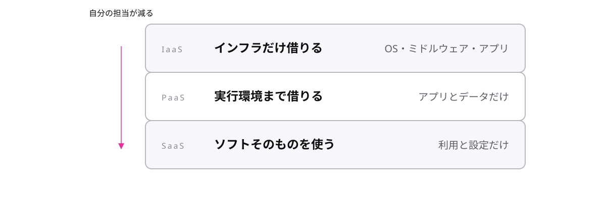

<!-- _class: lead -->

# 2-2-4
# IaaS・PaaS・SaaS

AWS Cloud Practitioner 入門 — Module 2 / レッスン2-2

<!-- ノート: 「任せる度合い」の軸を導入するトピック。M7の共有責任の伏線になります。 -->

---

## なぜ必要か

- 同じ「クラウド」でも、仮想サーバーとWebメールでは任せている範囲がまるで違う
- この違いを言い分ける言葉がないと、責任の話(M7)ができない
- 3階建ての言葉で整理する

<!-- ノート: つかみ。任せる範囲の違いに名前を付ける、という位置づけ。 -->

---

## 結論

**IaaS・PaaS・SaaSの違いは、どこまでをサービス提供側に任せるかというマネージドの度合い**

- **IaaS** = インフラだけ借りる(OSから上は自分)
- **PaaS** = 実行環境まで借りる(アプリだけ自分)
- **SaaS** = ソフトウェアそのものを使う(設定だけ自分)

<!-- ノート: 結論。Infrastructure/Platform/Software as a Service。下から順に「任せる範囲」が広がる。 -->

---

## 最小の例

<!-- ノート: 右列が自分の担当です。下へ行くほど短くなることが、この3語の全部です。 -->

---

## マネージドという言葉

- **マネージドサービス** = 運用の面倒(パッチ・バックアップ等)を提供側が持つサービス
- 「マネージドの度合いが上がる = 自分の担当が減る」
- この軸は、M7の共有責任モデルでそのまま再登場する

<!-- ノート: 補強枠。managedという語をここで固定。以降のRDS・Lambdaの説明で連発する。 -->

---

<!-- _class: summary -->

## まとめ

**IaaS・PaaS・SaaSの違いは、どこまでをサービス提供側に任せるかというマネージドの度合い**

<!-- ノート: 再掲のみ。明日はいよいよ個別サービス、まずコンピュートから、と口頭で引き。 -->
