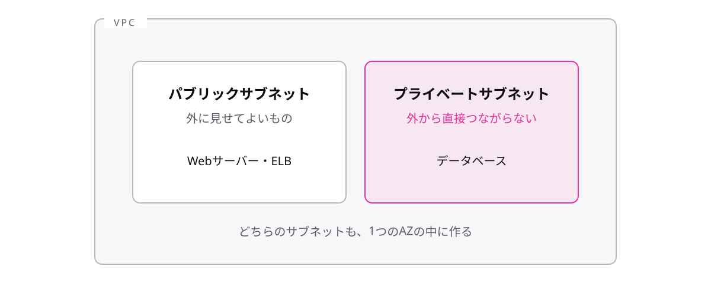

# レッスン4-1 VPCの部品

## このレッスンの目標

- [ ] VPC・サブネット・ゲートウェイの入れ子構造を絵に描ける
- [ ] Webサーバーとデータベースをどの区画に置くべきか、理由付きで言える
- [ ] セキュリティグループとネットワークACLの2軸の違いを表で言える

## 4-1-1 VPCは自分専用ネットワーク

> **VPCは、AWSの中に作る自分専用の仮想ネットワーク**

EC2を起動したとき、そのサーバーは「どこのネットワーク」にいるのでしょうか。他の利用者のサーバーと無防備に並ぶわけにはいきません。

物理配線に縛られず、ソフトウェアで定義するネットワークを **仮想ネットワーク** と呼びます。**VPC**(Virtual Private Cloud)は、AWSの中に作る自分専用の仮想ネットワークの区画です。EC2などのリソースはVPCの中に置き、他の利用者からは論理的に分離されます。

VPCはリージョンの中に作ります。M4のネットワークの話はすべて「VPCという1枚の絵」の上で起きるので、このレッスンでは絵を外側から順に完成させていきます。VPCはその外枠です。

## 4-1-2 サブネットで区画を分ける

> **サブネットはVPC内の区画で、外に見せるものはパブリック、隠すものはプライベートに置く**

Webサーバーは外から見えないと困り、データベースは外から見えたら困ります。同じVPCの中でも扱いを分けるために、VPCの中をさらに分けた区画を **サブネット** と呼びます。

- **パブリックサブネット** — インターネットから届く区画。店舗でいう売り場
- **プライベートサブネット** — 外から直接届かない区画。バックヤード

| 置くもの | 区画 | 理由 |
| --- | --- | --- |
| Webサーバー | パブリック | 利用者から届く必要がある |
| データベース | プライベート | 外から直接触らせない |

「データベースはプライベートサブネットへ」は、シナリオ問題で反射的に選べるようにしてください。サブネットは1つのAZの中に作るので、高可用性のためには複数のAZにサブネットを用意して分散します。入れ子は「VPC > サブネット > インスタンス」です。

## 4-1-3 出入り口のゲートウェイ

> **インターネットゲートウェイは外との出入り口、NATゲートウェイは中から外への一方通行の出口**

VPCは初期状態では閉じた敷地で、そのままではインターネットと一切通信できません。出入り口を付けます。ただし「向き」を選びます。

- **インターネットゲートウェイ**(IGW) — VPCとインターネットの双方向の出入り口。パブリックサブネットが使う
- **NATゲートウェイ** — プライベートサブネットから外へ「出るだけ」の口。外から入ることはできない

| 区画 | 使う口 | できること |
| --- | --- | --- |
| パブリックサブネット | インターネットゲートウェイ | 外から届く・外へ出る |
| プライベートサブネット | NATゲートウェイ | 外へ出るだけ(更新の取得など) |

プライベートサブネットのサーバーにも、OSの更新を取りに外へ出たい事情があります。「入られたくないが、出たい」に応えるのがNATゲートウェイです。試験では「プライベートサブネットからインターネットへ更新を取得したいが、外からの接続は許したくない」という言い回しがNATゲートウェイの合図です。

## 4-1-4 通信を守る2枚のフィルター

> **セキュリティグループはインスタンス単位のステートフル、ネットワークACLはサブネット単位のステートレスなフィルター**

出入り口ができても「誰でも通れる」では困ります。通信を検査するフィルターは2枚あり、違いがそのまま試験に出ます。

| | セキュリティグループ(SG) | ネットワークACL(NACL) |
| --- | --- | --- |
| 効く場所 | インスタンス単位 | サブネット単位 |
| 状態 | **ステートフル** | **ステートレス** |
| ルール | 許可のみ書ける | 許可と拒否を書ける |

2つの用語の意味はこうです。

- **ステートフル** — 通信のやりとりを覚えている。行き(リクエスト)を許可した通信の帰り(応答)は自動で通す
- **ステートレス** — 覚えていない。行きと帰りを別々のルールで判定する

ビルの例えなら、NACLはフロア(サブネット)の入館ゲート、SGは各部屋(インスタンス)の鍵です。覚える優先順位は「SG = インスタンス単位 = ステートフル」の組が最優先です。この組さえ固定すれば、NACLは「その逆」で導けます。

## もっと知りたい人へ

- ここまでの部品(VPC・サブネット・IGW/NAT・SG/NACL)を1枚に描いた絵は、practice.md のワークで自分の手で完成させます
- VPC同士をつなぐVPCピアリングや、複数VPCの接続を束ねるTransit Gatewayという発展の部品もあります(CLF-C02では名前を見かけたら「VPC同士をつなぐ話」と分かれば十分です)

---

演習は [practice.md](practice.md) にあります。
