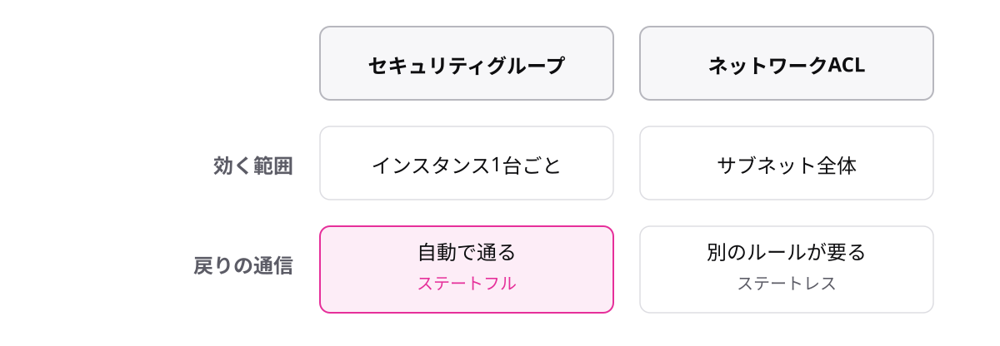

<!-- _class: lead -->

# 4-1-4
# 通信を守る2枚のフィルター

AWS Cloud Practitioner 入門 — Module 4 / レッスン4-1

<!-- ノート: CLF頻出の対比問題。SGとNACLの2軸の違いを固定するトピックです。 -->

---

## なぜ必要か

- 出入り口はできた。でも「誰でも通れる」では困る
- 通信を検査して、許可したものだけ通したい
- AWSにはフィルターが2枚あり、違いがそのまま試験に出る

<!-- ノート: つかみ。ビルの入館ゲートと各部屋の鍵、の例えを口頭で。 -->

---

## 結論

**セキュリティグループはインスタンス単位のステートフル、ネットワークACLはサブネット単位のステートレスなフィルター**

- **セキュリティグループ**(SG) = インスタンスに付ける通信フィルター
- **ネットワークACL**(NACL) = サブネットの境界に置くフィルター

<!-- ノート: 結論。「どこに効くか」と「覚えているか」の2軸で対比する。 -->

---

## 最小の例

<!-- ノート: 下段の「戻りの通信」がステートフルとステートレスの正体です。ここだけ色を付けてあります。 -->

---

## 2語の意味

- **ステートフル** = 通信のやりとりを覚えている。行きを許可した通信の返事は自動で通す
- **ステートレス** = 覚えていない。行きと帰りを別々のルールで判定する
- 迷ったら「SG = ステートフル」だけでも固定する

<!-- ノート: 補強枠。この2語の定義そのものが問われる。SGとステートフルの組を最優先で暗記。 -->

---

<!-- _class: summary -->

## まとめ

**セキュリティグループはインスタンス単位のステートフル、ネットワークACLはサブネット単位のステートレスなフィルター**

<!-- ノート: 再掲のみ。次のレッスンは社内とAWSをつなぐ話へ、と口頭で引き。 -->
