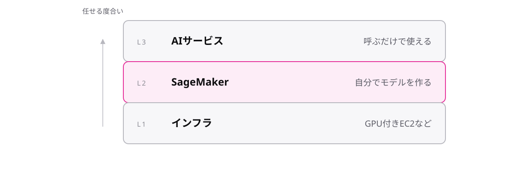

# レッスン6-1 AI・MLと分析

## このレッスンの目標

- [ ] AI/MLの3層(AIサービス・SageMaker・インフラ)から用途に合う層を選べる
- [ ] 代表的なAIサービス4つを「用途→名前」で言える
- [ ] 分析サービスを「受ける→ためる→調べる→見せる」の流れに配置し、EMR・OpenSearchの持ち場も言える

## 6-1-1 AI/MLは3層から選ぶ

> **AWSのAI/MLは、そのまま使うAIサービス・自分で作るSageMaker・土台のインフラの3層から選ぶ**

「AIを使いたい」と言っても、やりたいことの深さはばらばらです。データからパターンを学んで予測する技術を **機械学習**(ML)と呼び、AWSのAI/MLはこの深さで3層に分かれています。

| 層 | 中身 | 使う人 |
| --- | --- | --- |
| AIサービス | 出来合いの機能を呼ぶだけ | 開発者全般 |
| **SageMaker** | 自分のモデルを作って動かす | データサイエンティスト |
| インフラ | 計算資源(GPU付きEC2など) | 専門チーム |

**SageMaker** は、機械学習モデルを作り、訓練し、動かすためのマネージドな作業場です。料理に例えると、AIサービス層は外食、SageMakerは自炊のためのキッチン、インフラ層は厨房設備そのものです。

試験の判定は「作るのか、使うだけか」です。「機械学習の専門知識なしでAI機能を使いたい」ならAIサービス層、「独自のモデルを構築・訓練・デプロイしたい」ならSageMakerを選びます。CLF-C02の主戦場は上の2層で、インフラ層は「ある」と知っていれば十分です。

## 6-1-2 用途別AIサービス

> **画像はRekognition、文字起こしはTranscribe、読み上げはPolly、翻訳はTranslateと用途名で選ぶ**

AIサービス層には10を超えるサービスが並びますが、全部の機能説明を読むより「用途→名前」の対応表が速く、試験もその対応を選ばせるだけです。どれも機械学習の専門知識なしで、呼ぶだけで使えます。

| 用途 | サービス |
| --- | --- |
| 画像・動画の認識 | **Rekognition** |
| 音声 → 文字(文字起こし) | **Transcribe** |
| 文字 → 音声(読み上げ) | **Polly** |
| 翻訳 | **Translate** |

TranscribeとPollyは向きが逆の対で覚えます。名前は英単語の意味そのままです(recognition=認識、translate=翻訳する)。

このほか、文章の意味の分析はComprehend、チャットボットはLex、文書からの文字読み取りはTextract、検索はKendraなどがあります。今日全部を覚える必要はありません。出会ったら「用途の一言」を対応表に追記してください。

## 6-1-3 AthenaはS3をSQLで調べる

> **Athenaは、S3に置いたデータをそのままSQLで検索できるサーバーレスの分析サービス**

ログや履歴のファイルはS3にたまっていきます。調べたいだけなのに、データベースへ入れ直すのは大仕事です。

**Athena** は、S3上のファイルへ直接SQLを投げられるサーバーレスの分析サービスです。サーバーの用意は不要で、クエリの実行ごとに課金されます。データの引っ越しがゼロで済むのが最大の効き目で、その場限り(アドホック)の調査に向きます。

| 手順 | やること |
| --- | --- |
| 1 | ログファイルがS3にたまっている |
| 2 | Athenaで `SELECT ...` を実行 |
| 3 | 結果が返る(DBへの取り込み不要) |

相棒として **Glue** を覚えてください。データの在りかや形を整理する台帳(データカタログ)と、データ変換(ETL)の仕組みを提供するサービスです。Athenaは、Glueの台帳を見て「どのファイルがどんな表か」を知ります。「S3にためて、Glueで整理して、Athenaで調べる」が定番の組です。

## 6-1-4 流れで見る分析サービス

> **流れ続けるデータはKinesisで受け、蓄積と集計はRedshift、可視化はQuickSightが担う**

分析サービスの名前を個別に暗記するとすぐ混ざります。データが生まれてからグラフになるまでを1本の川と見て、持ち場で覚えてください。

| 持ち場 | サービス | 一言 |
| --- | --- | --- |
| 受ける | **Kinesis** | 流れ込むデータをリアルタイムに受ける |
| ためる | S3 / **Redshift** | 置き場 / 分析専用の倉庫 |
| 調べる | Athena / Redshift | 置いたまま / 倉庫で本格集計 |
| 見せる | **QuickSight** | グラフ・ダッシュボード |

- **Kinesis** — センサーやクリックログのように流れ続けるデータ(ストリーミングデータ)の受け口です
- **Redshift** — 分析専用の大規模データベースです。分析のためにデータを集めた倉庫を **データウェアハウス** と呼びます
- **QuickSight** — データをグラフやダッシュボードにする可視化(BI)サービスです

最後の落とし穴は、注文処理などの業務データベース(M5のRDS)と分析の倉庫(Redshift)の混同です。日々の取引をさばくのがRDS、たまった大量データを集計するのがRedshift、と役割で分けてください。

## 6-1-5 EMRとOpenSearchの持ち場

> **オープンソースの枠組みで大規模データを加工するのがEMR、ログの全文検索と可視化がOpenSearch Service**

分析の川の絵に、選択肢で登場する持ち場を2つ足します。

**EMR** は、Apache SparkやHadoopといったオープンソースの大規模データ処理基盤を、マネージドで動かすサービスです。既にこれらの枠組みで書かれた処理を持っている、または枠組みごと使いたい、という現場向けです。問題文にSparkやHadoopという **製品名がそのまま出てきたら** 、それを動かす場所=EMRと反射してください。

**OpenSearch Service** は、ログや文書を **全文検索** するサービスです。SQLの集計(AthenaやRedshift)が「数を数える」のに対し、OpenSearchは「キーワードで探す」が持ち場です。大量のエラーログから特定の文字列をほぼリアルタイムに探し、ダッシュボードで見張る、というシナリオで登場します。

| 用事 | 選ぶ |
| --- | --- |
| S3のデータにその場でSQL | Athena |
| 倉庫にためて本格集計 | Redshift |
| Spark / Hadoopの処理を動かす | **EMR** |
| ログをキーワードで全文検索 | **OpenSearch Service** |

## もっと知りたい人へ

- 生成AI系のサービス名を見かけた場合も、判定の軸は同じです。「作るのか、呼ぶだけか」の層で整理してください(受験時は最新のin-scope一覧を確認してください)

---

演習は [practice.md](practice.md) にあります。
