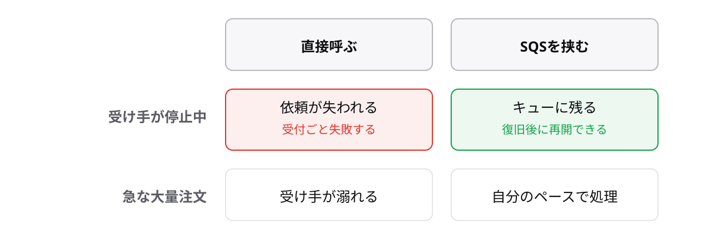

<!-- _class: lead -->

# 6-2-1
# SQSはキューで疎結合

AWS Cloud Practitioner 入門 — Module 6 / レッスン6-2

<!-- ノート: アプリ統合の1つ目。キューと疎結合という考え方ごと覚えるトピックです。 -->

---

## なぜ必要か

- 注文を受けるたびに、後続の処理(在庫・請求)を直接呼ぶ作りだと
- 後続が落ちた瞬間、注文の受付ごと止まる
- 「直接呼ばずに、依頼を置いておく」形にしたい

<!-- ノート: つかみ。直結の弱さ。ドミノ倒しの絵を口頭で。 -->

---

## 結論

**SQSは処理の依頼をキューにためて、受け手が自分のペースで取り出せるようにする**

- **キュー** = 依頼(メッセージ)を順番に並べる待ち行列
- **SQS** = そのマネージドなサービス
- 部品同士を直接つながない設計を **疎結合** と呼ぶ

<!-- ノート: 結論。回転寿司のレーンや、受付箱の例えを口頭で。 -->

---

## 最小の例

<!-- ノート: 色付きの行が疎結合の効き目です。受け手が止まった瞬間に何が違うかを読み上げます。 -->

---

## 試験での聞かれ方

- 「コンポーネント間を疎結合にしたい」→ SQS
- 「処理の失敗でメッセージを失いたくない」→ SQS
- キューは1対1の受け渡し。1対多の配信は次のSNSへ

<!-- ノート: 補強枠。次トピックとの対比の伏線を張る。 -->

---

<!-- _class: summary -->

## まとめ

**SQSは処理の依頼をキューにためて、受け手が自分のペースで取り出せるようにする**

<!-- ノート: 再掲のみ。次は「同じ知らせを大勢に配る」場合、と口頭で引き。 -->
