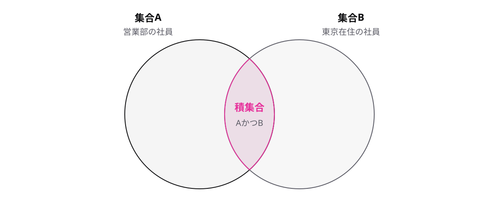

# レッスン1-2 論理演算と集合

## このレッスンの目標

- [ ] AND・OR・NOT・XORの真理値表を自分で書ける
- [ ] ド・モルガンの法則を使って、否定の式を書き換えられる
- [ ] 論理演算と集合(ベン図)の対応を説明できる

## 1-2-1 AND・OR・NOTの基本

> **論理演算の基本は、論理積(AND)・論理和(OR)・否定(NOT)の3つ**

コンピュータの中は、すべて0と1のビットです。「両方成り立つか」「どちらかが成り立つか」といった判断も、0と1の計算で表します。この0と1に対する計算が **論理演算** です。

基本の演算は3つあります。

- **論理積**(AND) — 両方が1のときだけ1になります
- **論理和**(OR) — どちらかが1なら1になります
- **否定**(NOT) — 0と1を反転します

入力と結果の全組み合わせをまとめた表が **真理値表** です。3つの演算の真理値表は次のとおりです。

| A | B | A AND B | A OR B |
| --- | --- | --- | --- |
| 0 | 0 | 0 | 0 |
| 0 | 1 | 0 | 1 |
| 1 | 0 | 0 | 1 |
| 1 | 1 | 1 | 1 |

| A | NOT A |
| --- | --- |
| 0 | 1 |
| 1 | 0 |

注意したいのはORの読み方です。ORを「どちらか一方だけが1」と覚えるのは誤りです。A=1、B=1 のときも A OR B は1になります。迷ったら真理値表を書き、最後の行まで確かめてください。

## 1-2-2 排他的論理和は「どちらか一方」

> **排他的論理和(XOR)は、2つの入力が異なるときだけ1になる**

「2つのうち、片方だけが成り立つ」を表したい場面があります。たとえば階段の照明は、上下2か所のスイッチのどちらでも切り替えられます。片方だけが入っているときに点灯する、という関係です。論理和(OR)は両方1でも1になるので、この「片方だけ」を表せません。

そこで使うのが **排他的論理和** です。英語の略でXORと書きます。真理値表は次のとおりです。

| A | B | A XOR B |
| --- | --- | --- |
| 0 | 0 | 0 |
| 0 | 1 | 1 |
| 1 | 0 | 1 |
| 1 | 1 | 0 |

入力が異なる行(0と1、1と0)だけ結果が1です。「同じなら0、違えば1」と覚えてください。

ORとの違いが出るのは A=1、B=1 の行だけです。ORは1、XORは0になります。選択肢で迷ったら、両方1の行だけ確かめれば判定できます。

## 1-2-3 ド・モルガンの法則

> **全体の否定は、ANDとORを入れ替えて個別に否定した式と等しい**

「東京在住 かつ 営業部」以外の人を探したいとします。否定が混ざった条件は、頭の中だけでは読み違えやすいものです。これを機械的に書き換える規則が **ド・モルガンの法則** です。

- NOT(A AND B) = (NOT A) OR (NOT B)
- NOT(A OR B) = (NOT A) AND (NOT B)

全体にかかった否定を中に配ると、ANDとORが入れ替わります。先ほどの例で確かめましょう。

- 条件: 「東京在住 かつ 営業部」
- その否定: 「東京在住でない **または** 営業部でない」

「かつ」の否定なのに、答えには「または」が現れる点がポイントです。大阪の営業部員も、東京の経理部員も、この否定に当てはまります。

丸暗記が不安なら、真理値表で全行を照合すれば検算できます。

| A | B | A AND B | NOT(A AND B) | (NOT A) OR (NOT B) |
| --- | --- | --- | --- | --- |
| 0 | 0 | 0 | 1 | 1 |
| 0 | 1 | 0 | 1 | 1 |
| 1 | 0 | 0 | 1 | 1 |
| 1 | 1 | 1 | 0 | 0 |

右の2列が全行で一致するので、2つの式は等しいと確かめられます。

## 1-2-4 集合とベン図

> **集合の重なりはベン図で描くと、論理演算と同じ形で整理できる**

「営業部の社員」「東京在住の社員」のような、ものの集まりが **集合** です。2つの集合の重なり具合を、円を一部重ねて描いた図が **ベン図** です。

集合A = 営業部の社員、集合B = 東京在住の社員として、ベン図の各部分に名前を付けます。

- **積集合**(AかつB) — 2つの円が重なった部分です。東京在住の営業部員が入ります
- **和集合**(AまたはB) — 2つの円を合わせた全体です。どちらかに当てはまる人が入ります
- **補集合**(Aでない) — 円Aの外側です。営業部以外の全員が入ります

この3つは、前のトピックまでの論理演算とそのまま対応します。

| 論理演算 | 集合 | ベン図での場所 |
| --- | --- | --- |
| 論理積(AND) | 積集合 | 円の重なった部分 |
| 論理和(OR) | 和集合 | 円を合わせた全体 |
| 否定(NOT) | 補集合 | 円の外側 |

0と1の計算と集合の整理は同じ形をしています。試験では同じ内容が論理演算の言葉でも集合の言葉でも出るので、この対応表を判定基準にしてください。

## もっと知りたい人へ

- 論理演算は3つ以上の入力にも広げられます。まずは2入力の真理値表を確実に書けるようにするのが先です
- ド・モルガンの法則は、集合のベン図でも同じ形で成り立ちます。「重なりの外側」を塗り分けて確かめてみてください
- XORには「同じ値を2回XORすると元に戻る」という性質があり、データの誤り検出などに応用されています

---

演習は [practice.md](practice.md) にあります。
