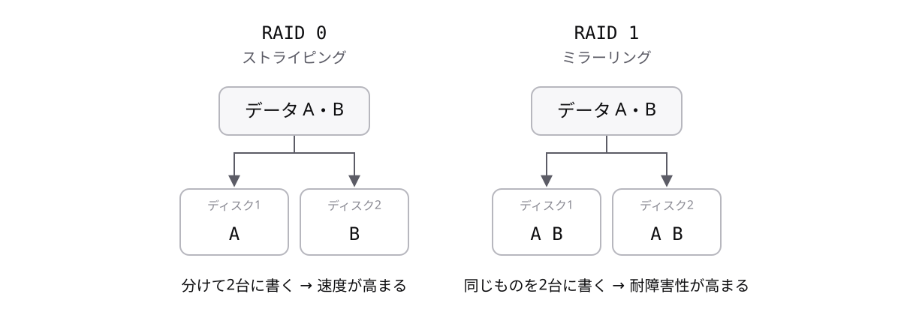
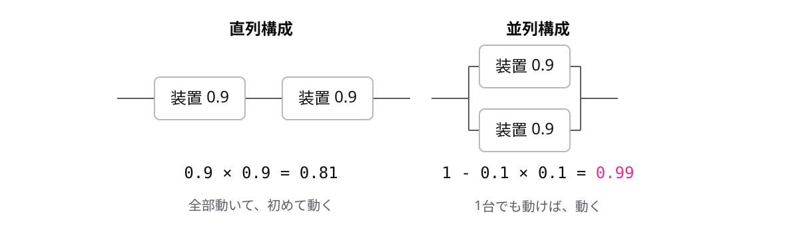

# レッスン2-2 システム構成と信頼性

## このレッスンの目標

- [ ] デュアルシステムとデュプレックスシステムの違いを説明できる
- [ ] RAID 0とRAID 1の目的の違いを説明できる
- [ ] MTBFとMTTRから稼働率を計算し、直列・並列構成に応用できる

## 2-2-1 冗長化で止まらないシステムを作る

> **冗長化は、機器を二重に用意して片方が壊れても止まらないようにする設計**

注文受付のシステムが1台の機器だけで動いていると、その1台が壊れた瞬間に業務が全部止まります。機器はいつか必ず壊れます。だから「壊れないようにする」のではなく、「壊れても止まらないようにする」設計が必要です。

そのために、あえて余分に機器を用意しておく設計が **冗長化** です。

| 構成 | 機器の数 | 1台壊れると |
| --- | --- | --- |
| 1台だけ | 1台 | 全部止まる |
| 冗長化 | 2台 | もう1台で動き続ける |

機器を2台にするだけで、システムが止まる条件は「2台とも壊れる」に変わります。止まる条件が厳しくなるほど、システムは止まりにくくなります。

2台の使い方には、代表的な構成が2つあります。

| 名前 | 2台の使い方 | 特徴 |
| --- | --- | --- |
| **デュアルシステム** | 2系統で同じ処理をして、結果を突き合わせる | 誤りに気づけて信頼性が高い |
| **デュプレックスシステム** | 主系が処理し、待機系は控えて待つ | 切り替えに少し時間がかかる |

デュアルは「2人が同じ計算をして答え合わせをする」、デュプレックスは「控えの選手がベンチで待つ」イメージです。この2つの取り違えを狙った選択肢が試験の定番なので、「同じ処理を両方でやるのがデュアル、控えが待つのがデュプレックス」と対で覚えてください。

## 2-2-2 RAIDはディスクを組み合わせる

> **RAIDは複数のディスクを組み合わせて、速度や耐障害性を高める仕組み**

大事なデータを1台のHDDにだけ入れていると、そのHDDが壊れたときにデータが全部消えます。また、1台では読み書きの速さにも限界があります。

そこで、HDDなどのディスクを複数台まとめて1台のように使う仕組みが **RAID** です。耐障害性とは、壊れてもデータや処理を失いにくい性質のことです。組み合わせ方には番号付きの方式があり、目的が違います。

まずはRAID 1です。同じデータを2台に書き込みます。鏡のように同じ内容を写すので **ミラーリング** と呼びます。

| 書き込むデータ | ディスク1 | ディスク2 |
| --- | --- | --- |
| A | A | A(複製) |
| B | B | B(複製) |

片方が壊れても、もう片方にデータが残ります。前のトピックで学んだ冗長化を、ディスクで実現した形です。

対してRAID 0は、データを分けて複数台に同時に書き込みます。分担して書くので速くなります。これを **ストライピング** と呼びます。

| 方式 | 呼び名 | やり方 | 高まるもの |
| --- | --- | --- | --- |
| RAID 0 | ストライピング | データを分けて複数台に同時に書く | 速度 |
| RAID 1 | ミラーリング | 同じデータを複数台に書く | 耐障害性 |

注意したいのは、RAID 0には耐障害性が無いことです。データを分けて置いているので、1台壊れると全体が失われます。速さと引き換えの構成です。試験では「番号・呼び名・目的」の3点セットで問われるので、この表ごと覚えてください。

## 2-2-3 稼働率の計算

> **稼働率は MTBF ÷ (MTBF + MTTR) で計算する**

「このシステムはどれくらい止まらないの?」と聞かれて、「だいたい大丈夫です」では比べることも約束することもできません。止まりにくさを数字で表すものさしが **稼働率** です。全体の時間のうち、システムが動いている時間の割合を表します。

計算に使う言葉は2つです。

- **MTBF** — 壊れるまで動き続ける平均時間(動いていた時間)
- **MTTR** — 修理にかかる平均時間(止まっていた時間)

具体的に計算してみます。

| 項目 | 値 | 意味 |
| --- | --- | --- |
| MTBF | 90時間 | 平均90時間動いて壊れる |
| MTTR | 10時間 | 修理に平均10時間かかる |

この装置は「90時間動いて10時間止まる」を繰り返します。全体100時間のうち90時間動くので、稼働率は次のとおりです。

稼働率 = 90 ÷ (90 + 10) = **0.9**

間違えやすいのは分母です。分母は「動いた時間 + 直した時間」、つまりMTBFとMTTRの合計です。

| 計算 | 式 | 結果 |
| --- | --- | --- |
| 正しい | 90 ÷ (90 + 10) | 0.9 |
| よくある間違い | 90 ÷ 10 | 9(割合として変) |

稼働率は割合なので、必ず0以上1以下になります。計算結果が1を超えたら、分母を間違えたサインです。この検算のクセを付けておくと、試験でも実務でも間違いに自分で気づけます。

## 2-2-4 つなぎ方で稼働率が変わる

> **直列構成は掛け算、並列構成は「全滅しない確率」で稼働率を求める**

実際のシステムは、装置1台ではなく複数の装置をつないで作ります。1台ごとの稼働率が分かっていても、全体の稼働率はつなぎ方で変わります。つなぎ方は2つに分けて考えます。

- **直列構成** — 全部の装置が動かないと、全体が動かないつなぎ方
- **並列構成** — どれか1台でも動けば、全体が動くつなぎ方

直列は「全員そろって初めて動く」、並列は「誰か1人いれば動く」イメージです。稼働率0.9の装置2台で、それぞれ計算してみます。

直列構成では、2台とも動いている確率を求めます。両方が同時に動く確率なので、掛け算です。

並列構成では、動く確率を直接掛けてはいけません。「2台とも止まる(全滅)」の確率を出して、1から引きます。各装置が止まる確率は 1 − 0.9 = 0.1 です。

| 構成 | 動く条件 | 計算 | 全体の稼働率 |
| --- | --- | --- | --- |
| 直列 | 2台とも動く | 0.9 × 0.9 | **0.81** |
| 並列 | どれか1台動く | 1 − (1 − 0.9) × (1 − 0.9) | **0.99** |

1台のときの0.9と比べると、直列は0.81に下がり、並列は0.99に上がります。直列は装置が増えるほど「全部動く」条件が厳しくなるので、稼働率は必ず下がります。並列は冗長化そのものです。予備を持たせる効果が、数字ではっきり見えます。

## もっと知りたい人へ

- RAIDにはRAID 5という方式もあります。データと一緒に、復元用の情報(パリティと呼びます)を複数台に分散して書き込みます。3台以上で構成し、1台壊れても残りから復元できるため、速度と耐障害性のバランスが取れた方式として広く使われています
- 試験では、直列と並列を組み合わせた構成(例: 並列にした2台と、もう1台を直列につなぐ)も出題されます。部分ごとに稼働率を求めてから、全体を1つの装置とみなして計算し直すのがコツです
- デュプレックスシステムの待機系には、常に起動して待つ方式と、故障してから起動する方式があります。切り替えの速さと費用のバランスで選びます

---

演習は [practice.md](practice.md) にあります。
