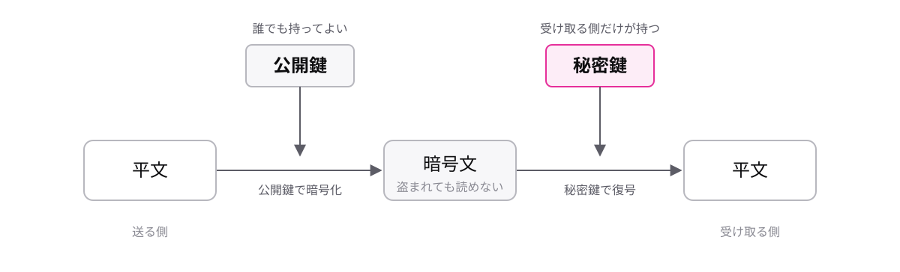

# レッスン3-3 セキュリティ

## このレッスンの目標

- [ ] 情報セキュリティの三要素を、崩れた例とセットで説明できる
- [ ] 共通鍵暗号方式と公開鍵暗号方式の違いを、鍵の扱いで説明できる
- [ ] デジタル署名の仕組みと、代表的な攻撃の手口を説明できる

## 3-3-1 情報セキュリティの三要素

> **情報セキュリティは機密性・完全性・可用性の3つを守ること**

**情報セキュリティ**(情報を安全な状態に保つこと)と一口に言っても、事故の形はさまざまです。漏れる、書き換えられる、使えなくなる — 起きることが全部違います。そこで、守るべき性質を3つに分けてとらえます。

| 要素 | 守ること | 崩れた例 |
| --- | --- | --- |
| **機密性** | 漏れない | 顧客名簿が外部に流出した |
| **完全性** | 書き換えられない | 請求金額が勝手に変わっていた |
| **可用性** | 止まらない | システムが落ちて業務が止まった |

「漏れない・書き換えられない・止まらない」の3語で覚えてください。試験では「この事例で損なわれたのはどの要素か」という形で問われます。

注意したいのは、3つは「どれか守れていればよい」ものではないことです。誰にも漏れないが、必要なときに使えないシステムは、機密性が保てていても可用性が崩れています。3つのバランスを取るのがセキュリティ対策です。

## 3-3-2 共通鍵暗号は同じ鍵を共有する

> **共通鍵暗号方式は暗号化と復号に同じ鍵を使い、高速だが鍵の受け渡しが課題**

データは送る途中で第三者に盗み見られるおそれがあります。そのまま送れば、見られた時点で機密性が崩れます。そこで、途中で見られても読めない形に変換して送ります。まず用語を固めましょう。

- **平文** — そのまま読める元のデータ
- **暗号文** — 読めない形に変換したデータ
- **暗号化** — 平文を暗号文にすること
- **復号** — 暗号文を平文に戻すこと(「復号化」とは言いません)
- **鍵** — この変換に使う秘密の情報

**共通鍵暗号方式**は、暗号化と復号に同じ鍵を使う方式です。

1. 送る側が、平文を鍵Kで暗号化して送る
2. 途中で盗み見られても、暗号文なので読めない
3. 受け取る側が、同じ鍵Kで復号して平文に戻す

家の合鍵のイメージです。同じ鍵を持つ2人だけが、閉めることも開けることもできます。処理が単純なので高速に動くのが長所です。

一方で課題もあります。鍵Kそのものを盗まれたら暗号文はすべて読まれてしまうのに、その鍵Kを相手へ安全に届ける手段がありません。さらに、相手ごとに別の鍵が必要なので、相手がn人なら鍵はn個になります。この「鍵の受け渡し問題」が、次の方式が生まれた理由です。

## 3-3-3 公開鍵暗号は鍵を2つ使う

> **公開鍵暗号方式は公開鍵で暗号化し、対になる秘密鍵だけで復号できる**

**公開鍵暗号方式**は、鍵をペアで作って役割を分けます。

- **公開鍵** — 暗号化用。誰に知られてもよい鍵
- **秘密鍵** — 復号用。自分だけが持つ鍵

錠前の比喩で覚えてください。

1. 受け取る側が、公開鍵(= 錠前)を配っておく
2. 送る側は、その錠前を掛けて箱を送る
3. 錠前を開けられる鍵(= 秘密鍵)は受け取る側だけが持つ

錠前は誰でも「掛ける」ことができますが、「開ける」には対の鍵が要ります。秘密鍵は誰にも渡さないので、鍵の受け渡し問題が起きません。

共通鍵暗号方式との違いを整理します。

| | 共通鍵暗号方式 | 公開鍵暗号方式 |
| --- | --- | --- |
| 鍵 | 同じ鍵を共有 | 公開鍵と秘密鍵のペア |
| 速度 | 高速 | 低速 |
| 鍵の受け渡し | 課題になる | 公開鍵は配ってよい |

公開鍵暗号方式は計算が複雑なぶん低速です。「一長一短」と押さえてください。

## 3-3-4 デジタル署名は改ざんとなりすましを見破る

> **デジタル署名は秘密鍵で署名し公開鍵で検証して、改ざんと本人性を確かめる**

届いた文書が、送られた後に書き換えられていないか。そもそも、名乗っている本人が送ったものか。暗号化は「読めなくする」技術なので、この2つの疑いには答えられません。ここで使うのが**デジタル署名**です。用語を3つ足します。

- **改ざん** — データを途中で勝手に書き換えること
- **なりすまし** — 別人が本人のふりをすること
- **ハッシュ値** — データから計算する「データの指紋」。データが1文字でも変わると、まったく別の値になります

仕組みは次のとおりです。

1. 送る側が、文書のハッシュ値を **自分の秘密鍵** で署名する
2. 受け取る側が、**送り主の公開鍵** で署名を検証する
3. 検証したハッシュ値と、文書から計算したハッシュ値を比べる
4. 一致すれば「改ざんなし」かつ「本人が送った」と確認できる

秘密鍵は本人しか持っていません。だから、対の公開鍵で検証できた時点で本人性が言えます。ハッシュ値の一致で完全性(改ざんされていないこと)が言えます。

暗号化とは鍵の使い方が逆になる点が、試験の最頻出ポイントです。

| | 暗号化 | デジタル署名 |
| --- | --- | --- |
| 使う鍵(送る側) | 相手の公開鍵 | 自分の秘密鍵 |
| 使う鍵(受け取る側) | 自分の秘密鍵 | 相手の公開鍵 |
| 確かめられること | 機密性(読めない) | 完全性と本人性 |

## 3-3-5 代表的なサイバー攻撃

> **サイバー攻撃は「何を狙う手口か」とセットで名前を覚える**

攻撃の被害は「ウイルスに感染した」と一括りで語られがちですが、実際の手口は狙いも被害もまったく別物です。名前の丸暗記では事例問題に対応できないので、「この手口は何を奪い、何を止めるのか」まで覚えます。

| 名前 | 何を狙う手口か |
| --- | --- |
| **マルウェア** | 悪意を持って作られたソフトウェアの総称 |
| **ランサムウェア** | データを使えなくし、身代金を要求する |
| **フィッシング** | 偽サイトへ誘導し、情報をだまし取る |
| **DoS攻撃** | 大量の通信を送りつけ、サービスを止める |
| **標的型攻撃** | 特定の組織を狙い、巧妙に仕掛ける |

補足が2つあります。マルウェアだけは個別の手口ではなく総称で、ランサムウェアはその一種です。フィッシングは、本物そっくりの偽サイトによる、なりすましの一種です。

三要素との対応づけも押さえてください。「この攻撃はどの要素を脅かすか」という形式の問題がそのまま出ます。

- ランサムウェア → データが使えない = **可用性** を脅かす
- フィッシング → 情報が漏れる = **機密性** を脅かす
- DoS攻撃 → サービスが止まる = **可用性** を脅かす

## もっと知りたい人へ

- 三要素には英語名があります。機密性は Confidentiality、完全性は Integrity、可用性は Availability で、頭文字を取って CIA と呼ばれます
- 実務の通信では、共通鍵暗号方式の高速さと公開鍵暗号方式の鍵の渡しやすさを組み合わせて使うのが一般的です
- 攻撃の名前は年々増えます。新しい名前に出会ったら「何を狙う手口か」から調べる習慣をつけると、応用が利きます

---

演習は [practice.md](practice.md) にあります。
