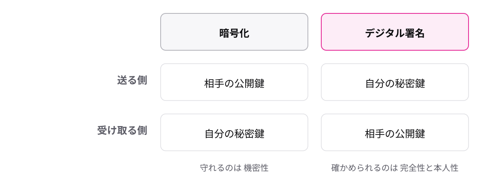

<!-- _class: lead -->

# 3-3-4
# デジタル署名は改ざんとなりすましを見破る

基本情報 科目A対策 — Module 3 / レッスン3-3

<!-- ノート: 公開鍵と秘密鍵のペアには、暗号化以外の使い道があります。それがデジタル署名です。 -->

---

## なぜ必要か

- 届いた文書が、送られた後に書き換えられていないか
- そもそも、名乗っている本人が送ったものか
- 暗号化は「読めなくする」技術。この2つの疑いには答えられない

<!-- ノート: つかみ。契約書のPDFがメールで届いた場面を想像させる。金額が途中で書き換わっていたら、読めるだけでは意味がない。 -->

---

## 結論

**デジタル署名は秘密鍵で署名し公開鍵で検証して、改ざんと本人性を確かめる**

- 改ざん = データを途中で勝手に書き換えること
- なりすまし = 別人が本人のふりをすること
- ハッシュ値 = データから計算する「データの指紋」

<!-- ノート: 用語を3つ定義する。ハッシュ値はデータが1文字でも変わると全く別の値になる、指紋のような短い値、とだけ押さえる。 -->

---

## 最小の例

1. 送る側: 文書のハッシュ値を **自分の秘密鍵** で署名する
2. 受け取る側: **送り主の公開鍵** で署名を検証する
3. 検証したハッシュ値と、文書から計算したハッシュ値を比べる
4. 一致すれば、改ざんなし・本人が送った、と確認できる

<!-- ノート: 秘密鍵は本人しか持っていない。だから、その公開鍵で検証できた時点で本人性が言える。ハッシュ値の一致で完全性(改ざんなし)が言える。 -->

---

## 暗号化とは鍵の使い方が逆

<!-- ノート: 対比枠。ここが試験の最頻出ポイント。「誰の・どちらの鍵か」を問う問題は、この図を思い出せれば解ける。 -->

---

<!-- _class: summary -->

## まとめ

**デジタル署名は秘密鍵で署名し公開鍵で検証して、改ざんと本人性を確かめる**

<!-- ノート: 再掲のみ。守る技術の次は、攻める側の手口を知る番だと口頭で予告する。 -->
