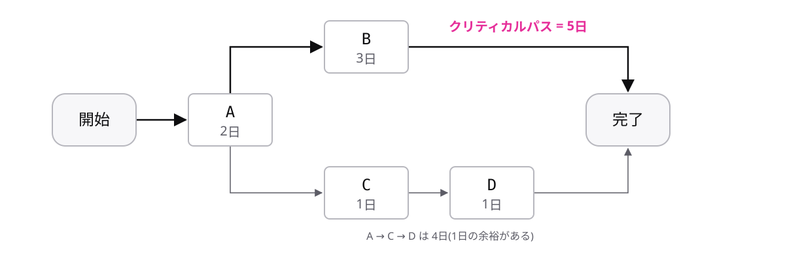

<!-- _class: lead -->

# 5-1-3
# クリティカルパスが納期を決める

基本情報 科目A対策 — Module 5 / レッスン5-1

<!-- ノート: 科目Aで計算問題として頻出のトピックです。最長経路の求め方を1つだけ押さえます。 -->

---

## なぜ必要か

- スコープで決めた作業には、順番の決まりがある
- 「設定が終わらないと動作確認できない」など待ちが生じる
- どの作業が遅れると全体が遅れるのか、見分けたい

<!-- ノート: つかみ。全作業の日数を単純に足しても納期は出ない。並行できる作業があるから。答えはまだ言わない。 -->

---

## 結論

**クリティカルパスは、余裕のない作業のつながりで、遅れが納期に直結する**

- 作業の順序を矢印で表した図が **アローダイアグラム**
- 開始から完了までの経路のうち、**所要日数** が最長の経路がクリティカルパス

<!-- ノート: 結論を言い切る。「最長経路=クリティカルパス=納期」。この等式が計算問題の解き方そのもの。 -->

---

## 最小の例

最長の5日がクリティカルパス。完了まで最短でも5日。

<!-- ノート: 作業A(2日)の後、B(3日)とC(1日)が並行し、Cの後にD(1日)。経路は A→B の 2+3=5日 と A→C→D の 2+1+1=4日。経路を全部書き出して足し算し、最長を選ぶだけ。試験の計算問題もこの手順で必ず解ける。 -->

---

## 遅れの影響は経路で違う

| 遅れる作業 | 完了日数 | 理由 |
| --- | --- | --- |
| Bが1日遅れる | 6日 | クリティカルパス上の作業 |
| Cが1日遅れる | 5日のまま | 経路に1日の余裕がある |

<!-- ノート: 補強枠。同じ1日の遅れでも影響が違う。クリティカルパス上の遅れだけが納期に直結する。 -->

---

<!-- _class: summary -->

## まとめ

**クリティカルパスは、余裕のない作業のつながりで、遅れが納期に直結する**

<!-- ノート: 再掲のみ。次は「進み具合をどう見える化するか」が要る、と口頭で引きだけ作る。 -->
