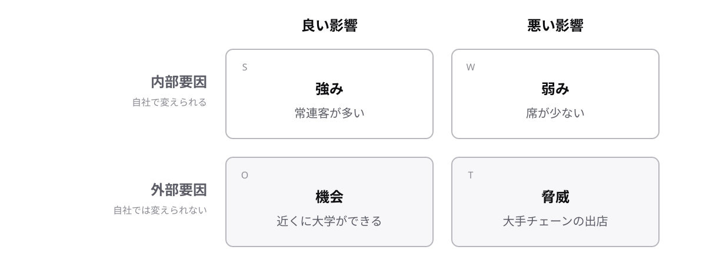

<!-- _class: lead -->

# 8-1-1
# SWOT分析で現状を整理

基本情報 科目A対策 — Module 8 / レッスン8-1

<!-- ノート: 経営戦略のレッスンの最初のトピックです。戦略を立てる前の「現状整理」の定番手法を1つだけ押さえます。 -->

---

## なぜ必要か

- 経営戦略は、まず自社の現状を知ることから始まる
- 思いつきで書き出すと、大事な視点が抜け落ちる
- 漏れなく現状を整理できる、決まった枠がほしい

<!-- ノート: つかみ。「うちの会社の強みは?」と聞かれて答えに詰まる場面を想像してもらう。答えはまだ言わない。 -->

---

## 結論

**SWOT分析は、強み・弱み・機会・脅威の4象限で現状を整理する手法**

- 自社の中の話が **強み** と **弱み**(内部要因)
- 自社の外の話が **機会** と **脅威**(外部要因)

<!-- ノート: 結論を言い切る。Strength・Weakness・Opportunity・Threatの頭文字でSWOT。内部×外部、良い×悪いの掛け算で4つになる。 -->

---

## 最小の例

駅前の喫茶店をSWOT分析します。

<!-- ノート: 2×2の図を縦横で読む。縦が内部か外部か、横が良い影響か悪い影響か。この形ごと覚えてもらう。 -->

---

## 内部と外部を取り違えない

- 「大手チェーンの出店」は自社では変えられない → 外部要因
- 「席が少ない」は自社の努力で変えられる → 内部要因
- 迷ったら「自社で変えられるか」で判定する

<!-- ノート: 補強枠。試験では「これはどの象限か」という出題が定番。内部か外部かの判定を最初に行うと迷わない。 -->

---

<!-- _class: summary -->

## まとめ

**SWOT分析は、強み・弱み・機会・脅威の4象限で現状を整理する手法**

<!-- ノート: 再掲のみ。現状を整理したら、次はどの事業にお金を配分するかが問題になる、と口頭で引きだけ作る。 -->
