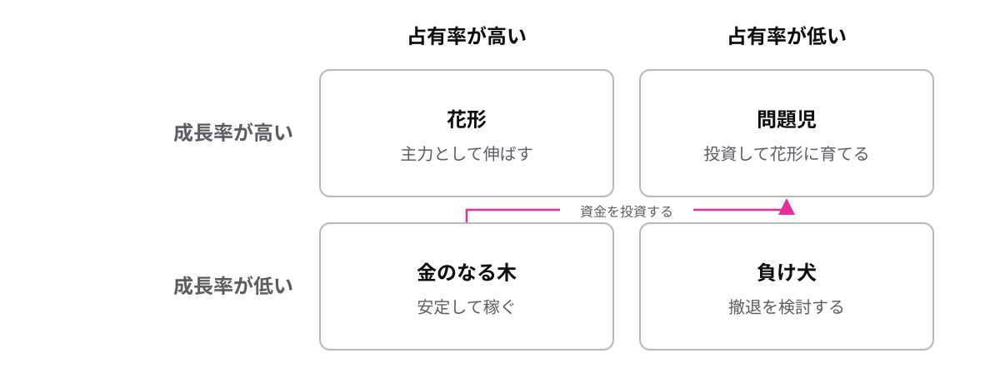

<!-- _class: lead -->

# 8-1-2
# PPMで事業の配分を決める

基本情報 科目A対策 — Module 8 / レッスン8-1

<!-- ノート: SWOT分析で現状を整理した次は、複数の事業へのお金の配分です。こちらも2×2の表で考えます。 -->

---

## なぜ必要か

- 会社は複数の事業を同時に抱えている
- お金と人は限られていて、全部には注げない
- どの事業に配分するかを決める、経営戦略の物差しがほしい

<!-- ノート: つかみ。飲料も化粧品もやる会社を想像してもらう。どちらに投資するかを勘で決めると危ない。答えはまだ言わない。 -->

---

## 結論

**PPMは、市場成長率と市場占有率で事業を4つに分類する手法**

- **市場成長率** = その市場が伸びる勢い
- **市場占有率** = 市場の中で自社が占める割合

<!-- ノート: 結論を言い切る。SWOT分析と同じく2軸の掛け算で4分類を作る。軸の名前2つを正確に覚えるのが最優先。 -->

---

## 最小の例

<!-- ノート: 花形は勢いも取り分もある主力事業、金のなる木は安定して稼げる事業、問題児は伸びる市場なのに取り分が小さい事業、負け犬は撤退を検討する事業。4つの名前は図の位置とセットで覚える。成長率が縦、占有率が横。矢印は次のスライドで説明する定石の流れ。名前が個性的なので位置さえ押さえれば得点源になる。 -->

---

## 定石: 金のなる木で稼ぎ、問題児に投資

- 金のなる木は投資が少なくても稼いでくれる
- その資金を問題児に投資し、花形に育てる
- 負け犬に資金を注ぎ続けるのは失敗パターン

<!-- ノート: 補強枠。試験は「どこで稼ぎ、どこへ投資するか」を問う。金のなる木→問題児という資金の流れを1本の矢印で覚える。 -->

---

<!-- _class: summary -->

## まとめ

**PPMは、市場成長率と市場占有率で事業を4つに分類する手法**

<!-- ノート: 再掲のみ。事業を選んだら、次は商品をどう売るかという話になる、と口頭で引きだけ作る。 -->
