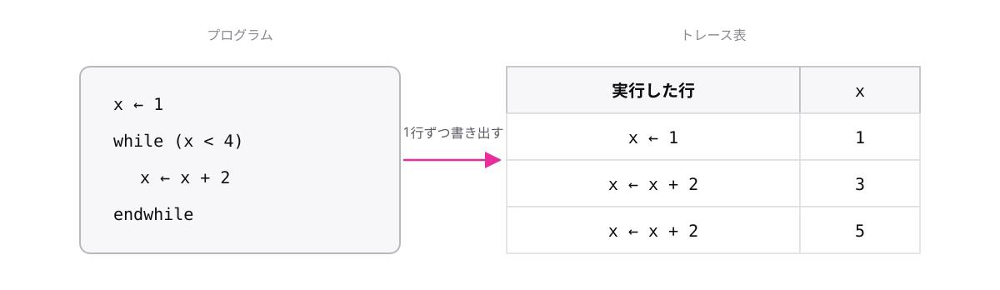

<!-- _class: lead -->

# 1-2-2
# トレース表で実行を追う

基本情報 科目B対策 — Module 1 / レッスン1-2

<!-- ノート: 科目B攻略の武器がトレースです。読み方の知識を、正解を選ぶ力に変える道具です。 -->

---

## なぜ必要か

- 繰返しのあるプログラムを頭の中だけで追うと、途中で値を見失う
- 「たぶんこうなる」で選ぶと、読み違いに気づけないまま失点する

<!-- ノート: つかみ。暗算で3周目のxの値を即答できますか、と問いかける。頭の中だけでは無理、という実感を作る。 -->

---

## 結論

**変数の値の変化を1行ずつ表に書き出すのがトレースの基本**

- トレース = プログラムを紙の上で1歩ずつ実行すること
- トレース表 = 各ステップでの変数の値を記録した表

<!-- ノート: トレースとトレース表を定義する。行が実行ステップ、列が変数。この形さえ守れば、どんなプログラムも追える。 -->

---

## 最小のコード

<!-- ノート: 代入のたびに1行足す。x=5で条件が偽になり終了。最終値は5。表を上から読めば実行の歴史がそのまま見える。 -->

---

## よくある失敗

- 繰返しの回数を頭の中で数えて、1回多く(少なく)実行してしまう
- トレース表なら、条件が真か偽かを **毎回書いて** 確かめられる

<!-- ノート: 失敗例の枠。繰返しの回数ずれは科目Bの定番のひっかけ。条件判定も表に書く癖をつければ防げる。 -->

---

<!-- _class: summary -->

## まとめ

**変数の値の変化を1行ずつ表に書き出すのがトレースの基本**

<!-- ノート: 結論の再掲だけ。次はこの表を、配列が出てくるプログラムで使ってみます、と口頭で引きを作る。 -->
