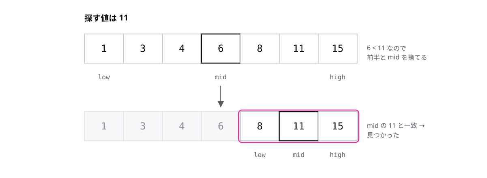

# レッスン2-1 探索アルゴリズム

## このレッスンの目標

- [ ] 線形探索の擬似言語を読み、戻り値をトレースできる
- [ ] 二分探索が範囲を半分ずつに絞る手順を説明できる
- [ ] O(n) と O(log n) の違いを比較回数で説明できる

## 2-1-1 線形探索は先頭から順に調べる

> **線形探索は、配列を先頭から1つずつ比較して目的の値を探す**

ここからアルゴリズムの学習に入ります。アルゴリズムとは、問題を解く手順のことです。最初のテーマは、配列から目的の値を探す **探索** です。

いちばん素直な探し方が **線形探索** です。配列を先頭から走査し、各要素と目的の値を **比較**(2つの値が等しいか調べること)していきます。

```text
○線形探索(整数型の配列: data, 整数型: target)
  整数型: i
  for (i を 1 から dataの要素数 まで 1 ずつ増やす)
    if (data[i] が target と等しい)
      return i
    endif
  endfor
  return -1
```

読み方のポイントは2つです。

- 一致した瞬間に `return i` で終わります。それより後ろは調べません
- 最後まで一致しなければ繰返しを抜け、`return -1` に到達します

`-1` は「見つからなかった」の合図です。添字は1から始まるので、`-1` が添字と重なることはありません。科目Bでは「この関数の戻り値はいくつか」という形でよく問われます。

## 2-1-2 二分探索は半分ずつ絞り込む

> **二分探索は、整列済みの配列を対象に探す範囲を半分ずつに絞り込む**

線形探索は、要素が1000個あると最悪1000回の比較が必要です。もっと少ない比較で探せるのが **二分探索** です。

ただし前提があります。対象の配列が **整列済み**(要素が小さい順、または大きい順に並んでいること)でなければ使えません。

考え方は、探す範囲を2つの添字で表すことから始まります。

- `low` — 探す範囲の先頭の添字
- `high` — 探す範囲の末尾の添字
- `mid` — 真ん中の添字。`(low + high) ÷ 2` の商(割り算の整数部分)

真ん中の要素 `data[mid]` と目的の値を比較し、結果に応じて範囲の半分を捨てます。



```text
○二分探索(整数型の配列: data, 整数型: target)
  整数型: low ← 1
  整数型: high ← dataの要素数
  整数型: mid
  while (low が high 以下)
    mid ← (low + high) ÷ 2 の商
    if (data[mid] が target と等しい)
      return mid
    elseif (data[mid] が target より小さい)
      low ← mid + 1
    else
      high ← mid - 1
    endif
  endwhile
  return -1
```

- `data[mid]` が目的の値より小さい → 答えは後半にしか無いので `low ← mid + 1`
- `data[mid]` が目的の値より大きい → 答えは前半にしか無いので `high ← mid - 1`
- `low` が `high` を超えたら範囲が空になり、`-1` を返します

「後半にしか無い」と言い切れるのは、配列が整列済みだからです。並んでいない配列では絞り込みが成り立たず、答えを見落とします。並んでいない配列には線形探索を使ってください。

## 2-1-3 計算量で速さを比べる

> **アルゴリズムの速さは、オーダー記法O(n)などの計算量で比べる**

「二分探索のほうが速い」を、きちんと言葉にする道具が **計算量** です。計算量は、要素数 n が増えたときに手間がどう増えるかの目安です。それを O(n) のように書く書き方を **オーダー記法** と呼びます。

探索1回あたりの最大の比較回数で比べてみます。

| 要素数 n | 線形探索 | 二分探索 |
| --- | --- | --- |
| 1000 | 最大 1000 回 | 約 10 回 |
| 100万 | 最大 100万 回 | 約 20 回 |

- 線形探索は、最悪の場合すべての要素と比較するので、手間が n に比例します。これを **O(n)** と書きます
- 二分探索は、1回の比較で範囲が半分になります。半分ずつ減らす形の増え方を **O(log n)** と書きます

log の数学的な定義まで覚える必要はありません。「O(log n) は、n が2倍になっても手間が1回増えるだけ」と読めれば十分です。

なお、要素が5個しかなければ線形探索でも最大5回で、差はほぼありません。計算量は「n が大きくなったときの増え方」を比べる道具です。

## もっと知りたい人へ

- 二分探索の比較回数「1000件で約10回」は、1000 を半分にしていくと約10回で1になることから来ています。紙で 1000 → 500 → 250 → … と書いてみると納得できます
- 実務のプログラミング言語では、探索は標準機能として用意されていることがほとんどです。それでも仕組みを知っていると、遅い処理の原因を見抜けるようになります

---

演習は [practice.md](practice.md) にあります。
