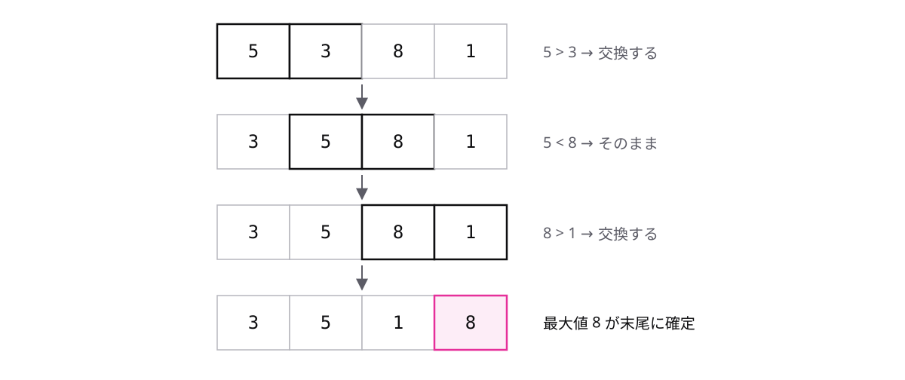

<!-- _class: lead -->

# 2-2-1
# 隣どうしの交換で並べ替える

基本情報 科目B対策 — Module 2 / レッスン2-2

<!-- ノート: このレッスンでは、配列を小さい順に並べ替えるアルゴリズムを3つ学びます。最初は、いちばん素朴なやり方からです。 -->

---

## なぜ必要か

- 二分探索は、整列済みの配列が前提だった
- 「点数の高い順」「値段の安い順」— 並べ替えはあらゆる処理の土台
- では、添字と繰返しだけで、配列をどう並べ替えるのか

<!-- ノート: 前のレッスンで整列済みという言葉だけ先に出てきました。今回はその「並べ替える」処理そのものを作ります。道具は配列・添字・繰返し・比較だけです。 -->

---

## 結論

**バブルソートは、隣どうしを比較して逆順なら交換を繰り返して整列する**

- 整列 = データを大小の順に並べ替えること
- 交換 = 2つの要素の値を入れ替えること
- 隣どうしを見て、左が大きければ交換する。これを繰り返すだけ

<!-- ノート: 整列と交換という言葉をここで定義します。やることは「隣を見る、逆順なら入れ替える」の繰り返しだけです。 -->

---

## 1パス目の動き — {5, 3, 8, 1}



- 端まで進む1往復を「パス」と呼ぶ。1パス目で最大値の 8 が末尾に来る

<!-- ノート: 隣どうしを左から順に比較していきます。大きい値は交換のたびに右へ運ばれるので、1パスの終わりには最大値が必ず末尾に着きます。次のパスは末尾を除いた範囲で同じことを繰り返します。 -->

---

## 交換は temp を使って3行

```text
temp ← array[j]
array[j] ← array[j + 1]
array[j + 1] ← temp
```

- 作業用の変数 temp に片方を退避してから入れ替える
- この3行を、パスを繰り返す二重の繰返しの内側に置く

<!-- ノート: 交換の3行は科目Bの定番の穴埋め箇所です。tempに退避せず直接代入すると、片方の値が消えてしまいます。この形をそのまま覚えてください。 -->

---

<!-- _class: summary -->

## まとめ

**バブルソートは、隣どうしを比較して逆順なら交換を繰り返して整列する**

<!-- ノート: 結論の再掲だけです。バブルソートは交換の回数が多いのが弱点です。もっと交換を減らせないか、という視点で次の動画を見てください。 -->
