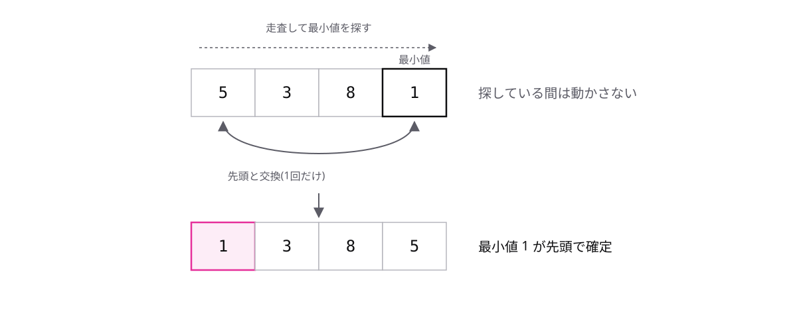

<!-- _class: lead -->

# 2-2-2
# 最小値を選んで並べ替える

基本情報 科目B対策 — Module 2 / レッスン2-2

<!-- ノート: 整列アルゴリズムの2つ目です。前の動画とは発想の違うやり方を見ていきます。 -->

---

## なぜ必要か

- バブルソートは、隣どうしの交換を何度も繰り返す
- 交換のたびに temp を使う3行の代入が動く。回数を減らしたい
- 交換を各パス1回で済ませる方法はないか

<!-- ノート: バブルソートの弱点は交換回数です。逆順の並びだと比較のたびに交換が起きます。ここを削る発想が今回のアルゴリズムです。 -->

---

## 結論

**選択ソートは、未整列部分から最小値を選んで先頭と交換していく**

- 最小値 = その範囲でいちばん小さい値
- 「探す(走査で最小値を見つける)」と「交換する(1回だけ)」の2段構え

<!-- ノート: ポイントは2段構えです。まず走査して最小値の場所を探すだけ探す。動かすのは最後の1回だけ。探索のレッスンでやった走査が、ここで部品として再登場します。 -->

---

## 1パス目の動き — {5, 3, 8, 1}

- 1パス目の終わりに、最小値の 1 が先頭で確定する

<!-- ノート: 探している間、配列は一切動きません。最小値の場所が確定してから、先頭と1回だけ交換します。次のパスは先頭を除いた未整列部分で同じことを繰り返します。 -->

---

## バブルソートとの対比

- バブルソート: 比較のたびに交換が起きうる
- 選択ソート: 1パスの交換は最後の1回だけ
- {5, 3, 8, 1} の1パス目 — バブルは交換2回、選択は1回

<!-- ノート: 比較の回数はどちらも変わりません。減るのは交換の回数です。試験では「交換は何回起きたか」を数えさせる問題が定番なので、この違いを押さえてください。 -->

---

<!-- _class: summary -->

## まとめ

**選択ソートは、未整列部分から最小値を選んで先頭と交換していく**

<!-- ノート: 結論の再掲だけです。整列のやり方はまだ他にもあります。次の動画では、もっと人間の手つきに近いやり方を見ます。 -->
