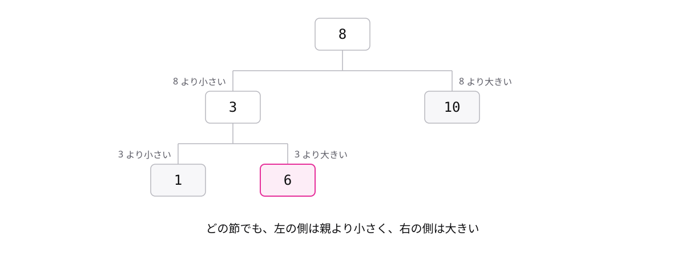

# レッスン3-3 木構造

## このレッスンの目標

- [ ] 木構造の根・節・葉を図の中で指せる
- [ ] 二分木の親・子(左の子・右の子)の関係を説明できる
- [ ] 値の列から二分探索木を描き、探索の手順をたどれる

## 3-3-1 木構造は階層を表す

> **木構造は根から枝分かれして節をたどる、階層を表すデータ構造**

リストは、ポインタで次の1つを指す一直線のデータ構造でした。しかし、会社の組織図やフォルダーの整理のように、世の中には枝分かれのある階層がたくさんあります。これを表すのが **木構造** です。

用語は3つだけ覚えます。

- **根** — いちばん上にある出発点
- **節** — 木を構成する1つ1つの要素
- **葉** — 枝分かれの先が無い、いちばん先の節

組織図を木構造で描くと、こうなります。

木を逆さにした形なので木構造と呼びます。根が上、葉が下です。枝分かれをたどるほど、階層が1つずつ下がると読んでください。

リストとの違いは、つながり方です。

| データ構造 | つながり方 |
| --- | --- |
| リスト | 前から次へ、一直線 |
| 木構造 | 根から複数へ、枝分かれ |

どちらもポインタで節をつなぐ点は同じです。指す先が1つならリスト、複数に枝分かれさせると木構造になります。

## 3-3-2 二分木は枝が2本まで

> **二分木は、各節が左右2つまでの子を持つ木構造**

木構造は枝分かれの数に制限がありません。そこで、枝分かれを2本までに決めたのが **二分木** です。

節どうしの関係を表す用語を2つ足します。

- **親** — ある節から見て、すぐ上の節
- **子** — ある節から見て、すぐ下の節

二分木の子は最大2つで、**左の子** と **右の子** に区別されます。

Bのように、親から見れば子、下から見れば親になる節もあります。Cのように子を持たない節(葉)があっても二分木です。

段の数にも軽く触れておきます。各節が子を2つずつ持つと、1段下がるごとに節は最大で2倍に増えます。

| 段の数 | 節の数(最大) |
| --- | --- |
| 1 | 1 |
| 2 | 3 |
| 3 | 7 |

つまり、少ない段の数でたくさんの節を収められる形です。この性質が次のトピックで効いてきます。

## 3-3-3 二分探索木は大小で振り分ける

> **二分探索木は「左は小さく右は大きく」の規則で値を配置した二分木**

二分探索は速い探索でしたが、整列済みの配列が前提でした。配列の途中に値を追加すると、後ろの要素をずらす手間がかかります。追加しながらでも速く探せるようにしたのが **二分探索木** です。

規則は1つだけです。どの節でも、左の子の側には親より小さい値だけ、右の子の側には親より大きい値だけを置きます。

空の木に 8, 3, 10, 1, 6 を順に入れてみます。値を入れるときは、根から比較を繰り返して置き場所を決めます。

| 入れる値 | たどり方 |
| --- | --- |
| 8 | 最初の値なので根になる |
| 3 | 8 より小さい → 8 の左の子になる |
| 10 | 8 より大きい → 8 の右の子になる |
| 1 | 8 より小さい → 左へ。3 より小さい → 3 の左の子になる |
| 6 | 8 より小さい → 左へ。3 より大きい → 3 の右の子になる |

できあがった木は、こうなります。

探すときも同じ規則で進みます。6 を探す場合は次の3回の比較で見つかります。

| 比較する節 | 6 との比較 | 進む方向 |
| --- | --- | --- |
| 8 | 6 は小さい | 左へ |
| 3 | 6 は大きい | 右へ |
| 6 | 等しい | 見つかった |

1回の比較で、反対側の節をまるごと調べずに済みます。半分ずつ範囲を捨てていく二分探索と同じ発想です。

## もっと知りたい人へ

- フォルダーの中にフォルダーがある構造は、まさに木構造です。手元のパソコンのフォルダーを1つ選び、根と葉を指してみてください
- 二分探索木は、値を入れる順番で形が変わります。同じ値の集まりでも、順番を変えて描き比べると理解が深まります

---

演習は [practice.md](practice.md) にあります。
