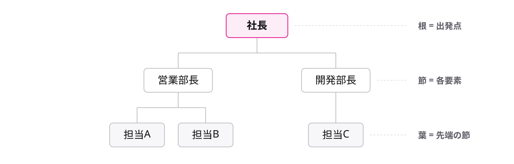

<!-- _class: lead -->

# 3-3-1
# 木構造は階層を表す

基本情報 科目B対策 — Module 3 / レッスン3-3

<!-- ノート: データ構造の学習の続きです。今回は、一直線ではない「枝分かれする」データ構造を扱います。 -->

---

## なぜ必要か

- 会社の組織図やフォルダーの整理は、上下の階層を持ちます
- リストはポインタで次の1つを指す、一直線のデータ構造でした
- 枝分かれのある形は、どう表せばよいのでしょうか

<!-- ノート: つかみ。組織図を思い浮かべてもらう。社長の下に部長が複数いる。一直線のリストでは、この「複数への枝分かれ」が表せない、と問いを立てる。 -->

---

## 結論

**木構造は根から枝分かれして節をたどる、階層を表すデータ構造**

- **根** — いちばん上にある出発点
- **節** — 木を構成する1つ1つの要素
- **葉** — 枝分かれの先が無い、いちばん先の節

<!-- ノート: 木を逆さにした形なので木構造と呼びます。根が上、葉が下です。節は英語でノードとも呼ばれますが、擬似言語の問題文では「節」が使われます。 -->

---

## 最小の例

<!-- ノート: 組織図は木を逆さにした形です。社長が根、枝分かれの先が無い担当者たちが葉、木を構成する1つ1つの要素はすべて節です。 -->

---

## リストとの対比

| データ構造 | つながり方 |
| --- | --- |
| リスト | 前から次へ、一直線 |
| 木構造 | 根から複数へ、枝分かれ |

- リストのポインタは次の1つだけを指します
- 木構造の節は、複数の節へ枝分かれできます

<!-- ノート: 対比枠。どちらもポインタでつなぐ点は同じで、指す先が1つならリスト、複数に枝分かれさせると木になる、という関係です。 -->

---

<!-- _class: summary -->

## まとめ

**木構造は根から枝分かれして節をたどる、階層を表すデータ構造**

<!-- ノート: 再掲のみ。枝分かれの数に決まりはあるのか、という問いを口頭で残して締める。 -->
