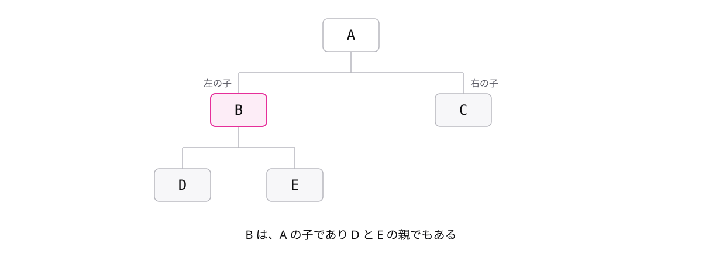

<!-- _class: lead -->

# 3-3-2
# 二分木は枝が2本まで

基本情報 科目B対策 — Module 3 / レッスン3-3

<!-- ノート: 木構造の続きです。今回は、枝分かれの数に決まりを付けた木を扱います。 -->

---

## なぜ必要か

- 木構造は、枝分かれの数に制限がありませんでした
- 枝分かれが多いほど、節をたどる手順は複雑になります
- 枝分かれの数を決めてしまうと、何が起きるでしょうか

<!-- ノート: つかみ。組織図なら部下は何人でもいた。プログラムで扱うには、枝分かれの数を決めた方が手順を単純に書ける、という動機を立てる。 -->

---

## 結論

**二分木は、各節が左右2つまでの子を持つ木構造**

- 節から見て、すぐ上の節を **親**、すぐ下の節を **子** と呼びます
- 子は **左の子** と **右の子** の最大2つで、区別されます

<!-- ノート: 二分木の「二分」は、枝分かれが2本まで、という意味です。左と右を区別するのがポイントで、左だけの節や右だけの節もあり得ます。 -->

---

## 最小の例

<!-- ノート: Aの子がBとC、Bの子がDとE。1つの節は、親から見れば子、その下から見れば親になります。Cのように子を持たない節があっても二分木です。 -->

---

## 段の数と節の数

| 段の数 | 節の数(最大) |
| --- | --- |
| 1 | 1 |
| 2 | 3 |
| 3 | 7 |

- 1段下がるごとに、節は最大で2倍に増えます
- 少ない段の数で、たくさんの節を収められる形です

<!-- ノート: 補強枠。根だけなら1段で1個。各節が子を2つずつ持つと、段が増えるたび倍々で増える。この「段が浅いのに大容量」が後で効いてきます。 -->

---

<!-- _class: summary -->

## まとめ

**二分木は、各節が左右2つまでの子を持つ木構造**

<!-- ノート: 再掲のみ。左と右の区別に意味を持たせると何ができるか、という問いを口頭で残して締める。 -->
