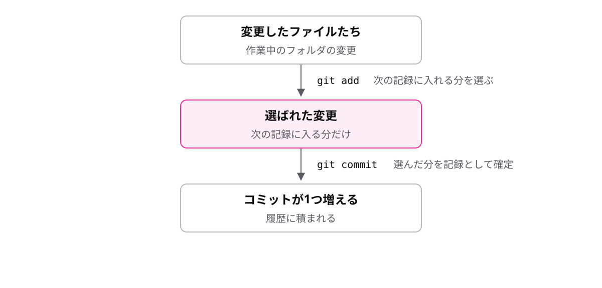

<!-- _class: lead -->

# 1-3-1
# コミットは2段階

Git入門研修 — Module 1 / レッスン1-3

<!-- ノート: コマンドを打つ前に、Gitの記録が2段階だという設計だけを先に頭に入れます。 -->

---

## なぜ必要か

- 作業中の変更は、記録したいものばかりとは限らない
- 「今回の記録に入れる変更」を選べないと、雑多な記録になってしまう

<!-- ノート: 提出書類を封筒に入れてから出す、のように「選んでから確定する」日常の感覚につなげます。 -->

---

## 結論

**記録は2段階:add で選んで、commit で記録する**

- add = 次の記録に入れるものを選ぶ
- commit = 選んだ分を記録として確定し、コミットを1つ作る

<!-- ノート: 2つのコマンド名と役割だけをセットで覚えます。1段階ではなく2段階なのは「選ぶ」ためです。 -->

---

## 最小の例

```text
変更したファイルたち
  │  git add   … 次の記録に入れる分を選ぶ
  ▼
選ばれた変更
  │  git commit … 選んだ分だけを記録にする
  ▼
コミットが1つ増える
```

<!-- ノート: 流れを上から指でなぞって読み上げます。addで選ばれなかった変更は、この記録には入らないという点も口頭で補足します。 -->

---

## 間に「選ぶ場所」がある



<!-- ノート: 真ん中の「選ばれた変更」に注目。この選ぶ場所があるから記録が2段階になっています。1段階でないのは、雑多な変更をそのまま記録しないためです。 -->

---

<!-- _class: summary -->

## まとめ

**記録は2段階:add で選んで、commit で記録する**

<!-- ノート: 結論の再掲だけ。ここからはこの2段階を1つずつ、実際のコマンドとして練習していきます、とナレーションでつなぎます。 -->
