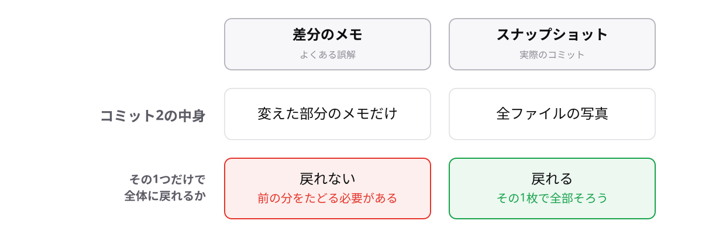

<!-- _class: lead -->

# 1-4-2
# コミットはスナップショット

Git入門研修 — Module 1 / レッスン1-4

<!-- ノート: 作ったコミットの「中身の正体」を1つだけ押さえる概念のトピックです。 -->

---

## なぜ必要か

- コミットには「変えた部分のメモだけ」が入っていると思われがち
- その誤解のままだと、「戻る」の意味がこの先うまく飲み込めない

<!-- ノート: 変更点だけの記録だと思っている人が大半です。ここで正しいイメージに置き換えます。 -->

---

## 結論

**コミットは差分ではなく、その時点のプロジェクト全体のスナップショット**

- スナップショットは「全ファイルをその瞬間ごと写した写真」のこと
- だからコミット1つ選べば、全体がその時点の状態で手に入る

<!-- ノート: 変更点のメモ帳ではなく全体写真。だから「戻る」が成り立つ、と理由までつなげます。 -->

---

## 最小の例

```text
コミット1 = [practice.txt(1行)]                    ← 全体の写真
コミット2 = [practice.txt(2行), memo.txt(1行)]     ← 全体の写真
```

- どのコミットも、触っていないファイルまで含めた全体の状態を持つ
- 「コミット2だけ見れば全部そろう」のがスナップショットの強み

<!-- ノート: 各コミットが独立した全体写真であることを、カッコの中身で見せます。差分をたどって復元する必要はありません。 -->

---

## メモではなく、全体の写真



<!-- ノート: 左が誤解、右が実際です。差が出るのは「その1つだけで全体に戻れるか」。写真だから戻れる、と理由ごと覚えてもらいます。 -->

---

<!-- _class: summary -->

## まとめ

**コミットは差分ではなく、その時点のプロジェクト全体のスナップショット**

<!-- ノート: 結論の再掲だけ。写真が増えてきたら、1枚1枚をどう呼び分けるのかが次の話です、とナレーションで含みを残します。 -->
