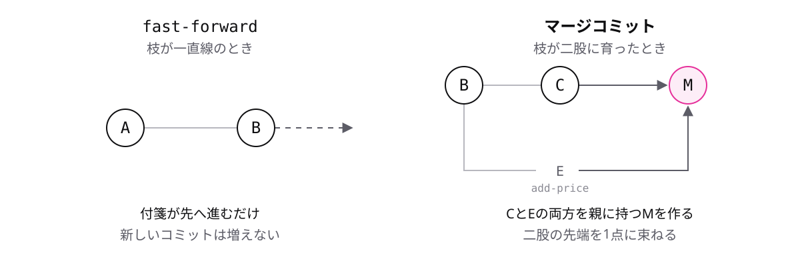

# レッスン7-1 マージの基本

## このレッスンの目標

- [ ] git merge で、枝の変更を「今いる枝」へ取り込める
- [ ] fast-forward とマージコミットの違いを説明できる
- [ ] git log --graph --oneline で、枝分かれと合流の形を確かめられる

## 7-1-1 git mergeで取り込む

> **git merge 枝名 は、その枝の変更を「今いる枝」へ取り込む**

Module 6 で「作業は main に直接ではなく、作業用ブランチで行う」と学びました。作業が終わったら、枝に積んだ変更を main へ合流させます。この合流を **マージ**(merge)と呼びます。

```bash
git merge fix-typo
# fix-typo に積んだコミットが、今いる枝に取り込まれる
```

覚えることは1つです。

- 枝名に書くのは「取り込みたい変更が載っている枝」
- 取り込み先は、コマンドを打ったときに**自分が居る枝**

「どの枝の変更を、どこへ入れるのか」。この向きが分かっていれば、merge は怖いコマンドではありません。

## 7-1-2 取り込む側に移ってから

> **merge は取り込む側で実行する(main へ入れるなら main に居る)**

merge には「取り込む側」と「取り込まれる側」があります。受け皿になるのはいつも「今いる枝」なので、マージの手順は必ず、行き先への移動から始まります。

```bash
git switch main       # 1. 受け皿になる main へ移る
git merge fix-typo    # 2. fix-typo の変更を main へ取り込む
```

よくある間違いが、作業用ブランチに居たまま `git merge main` と打ってしまうことです。これは main の変更を作業用ブランチへ取り込む操作で、向きが逆です。main は1つも進みません。

打つ前に `git branch` で今いる場所を確かめる。「移ってから merge」を1セットで覚えてください。

## 7-1-3 fast-forward

> **枝が一直線なら fast-forward(付箋が先へ進むだけ)で終わる**

枝を出してから main 側では何もコミットしていない、という場面は多くあります。このときのマージはとても簡単に済みます。


B から D までは一直線です。ブランチは「動く付箋」でしたから、main の付箋を先端 D まで滑らせれば合流は完了します。これが **fast-forward**(早送り)です。

- 新しいコミットは作られない
- どのコミットの中身も変わらない

マージの出力に `Fast-forward` と表示されたら、「付箋が進むだけの簡単なマージだった」と読んでください。

## 7-1-4 マージコミット

> **二股に育った枝は、両方を親に持つマージコミットで束ねられる**

枝で作業している間に、main 側にも新しいコミットが増えることがあります。枝が二股に育つと、付箋を先へ進めるだけでは合流できません。

```text
main:      A---B---C-------M   ← M がマージコミット
                \         /
add-price:       D---E---
```

この場合、Git は両方の変更を合わせた新しいコミット M を作ります。これが **マージコミット** です。

- 普通のコミットの親は1つ。マージコミットは C と E の**2つを親に持つ**
- main の付箋は M へ進み、add-price の付箋は E のまま

二股の先端どうしを1点に束ねる「結び目」だと思ってください。なお、マージコミットを作るときにもコミットメッセージが要ります。実行時にメッセージ入力の画面が開くことがあるので、この研修では `git merge 枝名 -m "メッセージ"` のように -m を付けて実行します。

前トピックとの違いを並べると、マージのしかたは枝の形で決まることが分かります。



## 7-1-5 --graphで形を見る

> **git log --graph --oneline で、枝分かれと合流の形を確かめられる**

マージを重ねると、履歴は一直線ではなくなります。枝分かれの形を目で確かめるオプションが **--graph** です。

```bash
git log --graph --oneline
# *   9c3f2e1 価格表の更新を取り込む
# |\
# | * 4d8a7b2 単価を改定
# * | 1f6e9c3 会議メモを追加
# |/
# * 7a2b5d8 企画書を作成
```

線が二股に分かれ、また1点に戻っているのが読み取れます。一番上の `9c3f2e1` が、親を2つ持つマージコミットです。fast-forward で終わったマージなら、線は一直線のままです。

「マージしたら --graph で形を確かめる」を習慣にすると、いま履歴がどうなっているかを迷わなくなります。

## もっと知りたい人へ

- [git merge — 公式リファレンス](https://git-scm.com/docs/git-merge) — fast-forward の条件やオプションの一覧
- [git log — 公式リファレンス](https://git-scm.com/docs/git-log) — --graph をはじめとした表示オプション

---

演習は [practice.md](practice.md) にあります。
