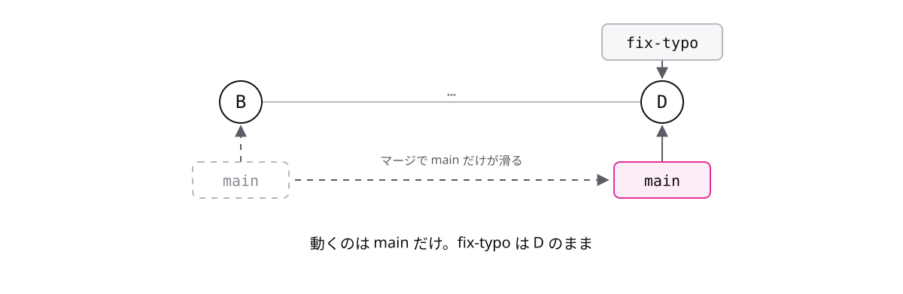

<!-- _class: lead -->

# 7-1-3
# fast-forward

Git入門研修 — Module 7 / レッスン7-1

<!-- ノート: マージの一番簡単なパターンです。出力に出るfast-forwardという単語の意味を押さえます。 -->

---

## なぜ必要か

- 枝を出してから、main 側では何もコミットしていない場面は多い
- このときのマージがどうなるかを知っておくと、出力に驚かない

<!-- ノート: 短い作業ならmain側は動いていないのが普通です。実はこの場合、マージはとても簡単に済みます。 -->

---

## 結論

**枝が一直線なら fast-forward(付箋が先へ進むだけ)で終わる**

- 新しいコミットは作られない
- ブランチ(動く付箋)が枝の先端まで滑っていくだけ

<!-- ノート: fast-forwardは早送りという意味です。合流といっても混ぜる作業は無く、mainの付箋が前へ進むだけで終わります。 -->

---

## 最小の例

```text
マージ前:  A---B---C---D
               ↑main   ↑fix-typo

マージ後:  A---B---C---D
                   ↑fix-typo ↑main
```

- 動くのは main だけ。fix-typo は D のまま
- 出力には「Fast-forward」と表示される

<!-- ノート: BからDまでが一直線なので、mainの付箋をDまで早送りすれば合流完了です。fix-typoはDを指したまま動きません。コミットA〜Dはどれも変わっていません。 -->

---

## 付箋が滑って終わり



<!-- ノート: 破線がマージ前のmainの位置です。動くのはmainの付箋だけで、fix-typoはDを指したまま動きません。コミットの並びも変わりません。これが早送り=fast-forwardの正体です。 -->

---

<!-- _class: summary -->

## まとめ

**枝が一直線なら fast-forward(付箋が先へ進むだけ)で終わる**

<!-- ノート: 結論の再掲だけ。では一直線でなかったらどうなるのか、という問いを残して次へつなぎます。 -->
