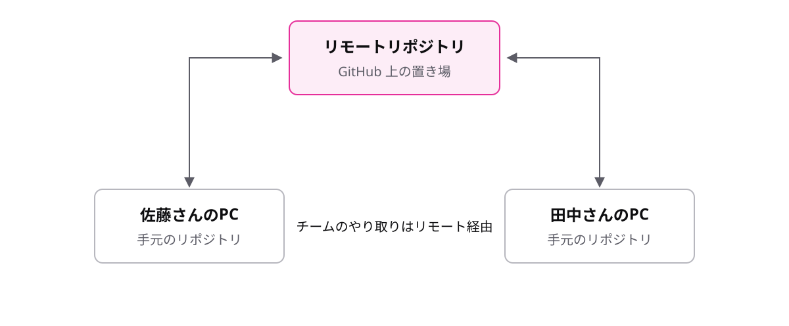

# レッスン8-1 リモートリポジトリ

## このレッスンの目標

- [ ] リモートリポジトリが何のためにあるかを説明できる
- [ ] GitHub でリポジトリを作り、git clone で手元にコピーできる
- [ ] origin が何を指すかを説明し、git remote -v で確かめられる

## 8-1-1 リモートは共有の置き場

> **リモートリポジトリは、共有のために GitHub 上に置くもう1つのリポジトリ**

これまで学んだコミットもブランチもマージも、すべて自分のPCの中だけで起きていました。このままでは2つの問題があります。

- 積み上げたコミットをチームの誰にも見せられない
- PCが壊れたら、作業フォルダも履歴もまとめて消える

そこで、手元のリポジトリとは別に、チームの全員から見える場所へもう1つリポジトリを置きます。これが **リモート** リポジトリで、置き場所として使うのが GitHub です。



メンバーどうしが直接ファイルを渡し合うのではなく、真ん中のリモートを経由してコミットをやり取りします。中身はこれまで学んだリポジトリと同じもので、置き場所が GitHub 上というだけです。

## 8-1-2 GitHubでリポジトリを作る

> **GitHub で空のリポジトリを作ると、共有用の URL が手に入る**

リモートの置き場は、GitHub の画面から数十秒で作れます。

1. GitHub にログインし、「New repository」を選ぶ
2. リポジトリ名(例: `daily-report`)を入力して作成する
3. 表示された **URL** をコピーする

```text
https://github.com/sato-dev/daily-report.git
```

URL はそのリポジトリのインターネット上の住所です。以後の共有の操作は、すべてこの URL を通して行います。末尾が `.git` で終わる形をしていることも覚えておきましょう。

## 8-1-3 git cloneでコピーする

> **git clone URL で、リモートを履歴ごと手元にコピーできる**

現場に配属されると、まず既存のプロジェクトを手元に持ってくるところから仕事が始まります。それを行うのが **clone**(複製)です。

```bash
git clone https://github.com/sato-dev/daily-report.git
# Cloning into 'daily-report'...
cd daily-report
```

- 最新のファイルだけでなく、過去の履歴もまるごと手に入ります
- コピー先として、リポジトリ名と同じ `daily-report` フォルダが自動で作られます
- 作られたフォルダに cd で入ってから作業を始めます

「全員が完全な履歴のコピーを手元に持つ」という分散型の性質が、clone の動きにそのまま表れています。

## 8-1-4 originは呼び名

> **origin は clone 元のリモートに自動で付く呼び名**

リモートを指すたびに、あの長い URL を打つのは現実的ではありません。そこで Git は、clone した時点で clone 元のリモートに **origin** という呼び名を自動で付けます。

```text
origin = https://github.com/sato-dev/daily-report.git
```

- 自分で設定する必要はありません(clone すれば付いています)
- 以後は URL の代わりに origin と書けば、そのリモートを指せます

スマホの連絡先に「会社」と登録しておけば番号を暗記しなくてよいのと同じで、origin はただの呼び名です。画面表示に origin が出てきても、身構える必要はありません。

## 8-1-5 remote -vで確かめる

> **git remote -v で、どのリモートと繋がっているかを確かめる**

似た名前のリポジトリを複数 clone していると、「この origin はどこを指しているのか」と不安になる場面があります。そんなときは対応表を表示します。

```bash
git remote -v
```

```text
origin  https://github.com/sato-dev/daily-report.git (fetch)
origin  https://github.com/sato-dev/daily-report.git (push)
```

- `-v` は「詳しく表示する」という意味のオプションです
- 行末の `(fetch)` と `(push)` は受け取り用・送り用の内訳です(次のレッスン以降で学びます)。2行とも同じ URL なら正常です

困ったらまず status を打つのと同じ感覚で、リモート関係で迷ったらまず `git remote -v` を打ちましょう。

## もっと知りたい人へ

- [git clone — 公式リファレンス](https://git-scm.com/docs/git-clone) — clone の詳しいオプション
- [git remote — 公式リファレンス](https://git-scm.com/docs/git-remote) — リモートの登録を扱うコマンド
- [リポジトリのクイックスタート — GitHub Docs](https://docs.github.com/ja/repositories/creating-and-managing-repositories/quickstart-for-repositories) — GitHub 上でリポジトリを作る手順

---

演習は [practice.md](practice.md) にあります。
