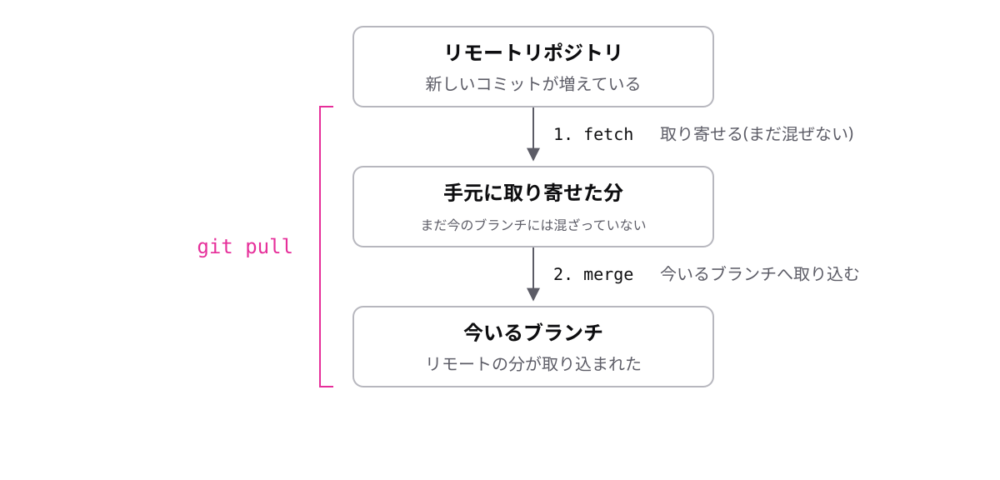

<!-- _class: lead -->

# 8-3-2
# pull = fetch + merge

Git入門研修 — Module 8 / レッスン8-3

<!-- ノート: pullの中身を分解します。この分解が分かると、pullで起きることが全部説明できるようになります。 -->

---

## なぜ必要か

- pull の最中にコンフリクトが起きて、驚く人が多い
- 「取り込む」の中で実際に何が起きているかを知っておきたい

<!-- ノート: pullは魔法の同期ボタンではない。中身を知らないと、途中で止まったときに手が出せません。 -->

---

## 結論

**pull は fetch(取り寄せ)と merge(取り込み)の合わせ技**

- **fetch**: リモートに増えたコミットを手元に取り寄せる(まだ混ぜない)
- merge: 取り寄せた分を、今いるブランチへ取り込む

<!-- ノート: fetchという語をここで定義。荷物を玄関まで運ぶのがfetch、部屋に納めるのがmergeです。 -->

---

## 最小の例

```text
git pull の中身:

1. fetch  … リモートの新しいコミットを受け取る
2. merge  … それを今いるブランチに合流させる
```

- merge だから、同じ箇所を互いに変えていればコンフリクトも起きる

<!-- ノート: pull中のコンフリクトは故障ではなく、ただのmergeのコンフリクト。解決の手順も学んだとおりです。 -->

---

## 2つの動きがつながっている



<!-- ノート: 左のかっこが git pull の範囲です。コンフリクトが起きるとしたら2のmergeの段階、と図の上で場所を特定しておきます。 -->

---

<!-- _class: summary -->

## まとめ

**pull は fetch(取り寄せ)と merge(取り込み)の合わせ技**

<!-- ノート: 結論の再掲だけ。取り寄せた位置を指す目印がログに出てきます。その正体を次で確かめます。 -->
