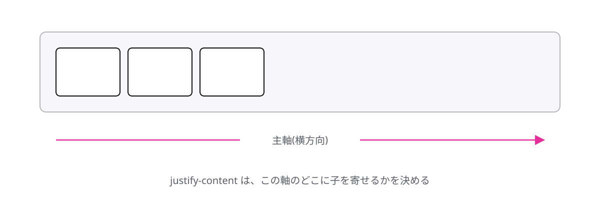

# レッスン4-3 Flexの揃えと折り返し

## このレッスンの目標

- [ ] justify-content で主軸の寄せ方を決められる
- [ ] align-items で交差軸の揃え方を決められる
- [ ] flex-wrap で折り返しを許すかどうかを選べる

## 4-3-1 justify-contentは主軸の寄せ方

> **justify-contentは、フレックスアイテムを主軸のどこに寄せるかを決める**

ヘッダーでロゴを左、メニューを右に置きたい。この「両端に寄せる」並びは、どの案件でも出てきます。`margin` で押し広げても作れますが、画面幅が変わるたびにずれます。

主軸方向の寄せ方を決めるのが **justify-content** です。



```css
.header {
  display: flex;
  justify-content: space-between;
}
```

指定するのは、いつもどおりフレックスコンテナ側です。

| 値 | 並び方 |
| --- | --- |
| `flex-start` | 主軸の先頭に寄せる(既定) |
| `center` | 主軸の中央に寄せる |
| `flex-end` | 主軸の末尾に寄せる |
| `space-between` | 両端に寄せ、余りを間に均等に配る |

**space-between** は、ロゴとメニューのように2つのアイテムを左右に離したいときの定番です。アイテムが3つ以上あっても、余りが等分されるので等間隔になります。

プロパティ名は覚えにくいので、「主軸の寄せ方は justify-content」と軸とセットで覚えてください。

## 4-3-2 align-itemsは交差軸の揃え方

> **align-itemsは、フレックスアイテムを交差軸のどこに揃えるかを決める**

アイコンと文字を横に並べたときに、高さがずれて不格好になることがあります。主軸ではなく、交差軸の位置の話です。

```css
.row {
  display: flex;
  align-items: center;
}
```

| 値 | 揃え方 |
| --- | --- |
| `stretch` | 交差軸いっぱいに引き伸ばして揃える(既定) |
| `center` | 交差軸の中央にそろえる |
| `flex-start` | 交差軸の先頭(既定の向きなら上)にそろえる |

既定が `stretch` である点に注目してください。4-2-4 で見た「カードの高さが勝手に揃う」動きは、この既定によるものです。`center` を指定すると引き伸ばしをやめるので、アイテムはそれぞれ中身のぶんの高さになり、上下の中心でそろいます。

覚え方は主軸と対にすると簡単です。

- 主軸 → `justify-content`
- 交差軸 → `align-items`

## 4-3-3 flex-wrapで折り返しを許す

> **flex-wrap: wrapを指定すると、1行に収まらないアイテムが次の行へ送られる**

カードを6枚並べると、1枚ずつが細く潰れて中身が読めなくなります。4-2-4 で見たとおり、フレックスアイテムは既定で **折り返さずに縮む** ためです。

この既定を変えるのが **flex-wrap** です。

```css
.row {
  display: flex;
  flex-wrap: wrap;
  gap: 16px;
}

.card {
  width: 300px;
}
```

| 指定 | 1行に収まらないとき |
| --- | --- |
| `nowrap`(既定) | 1行のまま、アイテムが縮んで収まろうとする |
| `wrap` | 複数の行に分けて並べる(**折り返し**) |

幅を決めたアイテムと組で使うのが基本形です。`gap` は行と行のあいだにも効くので、折り返しても間隔が揃います。

1つ、勘違いしやすい点があります。**`wrap` は「行を分ける」指定であって、「縮まなくする」指定ではありません。** 行に分けたあとも、各行の中では既定でアイテムが縮みます。たとえば `width: 300px` のカードでも、画面の幅が300pxを下回れば、`wrap` を指定していても縮みます。縮ませたくないときは、アイテム側に `flex-shrink: 0` を指定します。

どちらが正しいという話ではありません。**中身が読める状態を保てるほう** を選んでください。カードのように中に文章が入るものは `wrap`、アイコンの列のように潰れても困らないものは既定のままで構いません。

## もっと知りたい人へ

- 並ぶ向きそのものを縦に変える `flex-direction: column` という指定もあります。主軸が縦になるので、`justify-content` と `align-items` の効く向きも入れ替わります
- 交差軸方向に1つのアイテムだけ位置を変えたいときは、そのアイテムに `align-self` を指定します

---

演習は [practice.md](practice.md) にあります。
