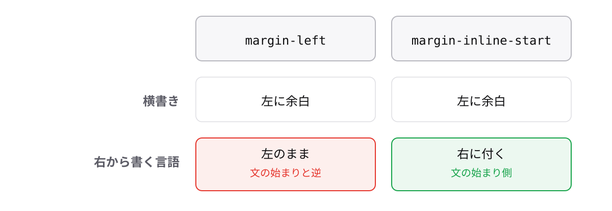

<!-- _class: lead -->

# 2-2-1
# 余白は流れの向きで書ける

モダンCSS入門 — Module 2 / レッスン2-2

<!-- ノート: このレッスンは、上下左右の代わりに「文章の流れる向き」で書く新しい語彙です。 -->

---

## なぜ必要か

- `margin-left` と `margin-right` に同じ値を2行書くことが多い
- 縦書きや右から書く言語では、「左」が文の先頭とは限らない

<!-- ノート: つかみ。物理的な上下左右は、書字方向が変わると意味がずれます。 -->

---

## 結論

**`margin-inline`は、文章が流れる向きを基準に左右の余白をまとめて指定する**

- 流れの向きで書くプロパティを **論理プロパティ** と呼ぶ
- inline = 文字が進む向き(日本語の横書きなら左右)

<!-- ノート: 結論。「左右」ではなく「文の進む向きの両端」と捉え直します。 -->

---

## 最小のコード

```css
.container {
  margin-inline: auto;
}

.title {
  margin-block: 24px;
}
```

- `margin-block` = 行が積み重なる向き(横書きなら上下)

<!-- ノート: margin-inline: auto は入門の margin: 0 auto と同じ中央寄せが1語で書けます。 -->

---

## 向きが変わると差が出る



<!-- ノート: 図解枠。横書きでは同じ結果になるので違いが見えない。右から書く言語に切り替わったとき、物理プロパティは左のままずれ、論理プロパティは文の始まり側に付く。対応表はまとめの資料にある。 -->

---

<!-- _class: summary -->

## まとめ

**`margin-inline`は、文章が流れる向きを基準に左右の余白をまとめて指定する**

<!-- ノート: 結論の再掲だけ。次は幅と高さの論理版です。 -->
