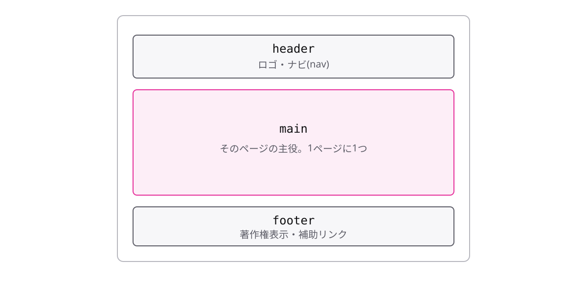

# レッスン1-1 骨格を置く

## このレッスンの目標

- [ ] ページの骨格を landmark になる要素で組める
- [ ] `main` を 1 つに保ち、内容を landmark の中に収められる
- [ ] ページ全体のトークンを `:root` の 1 セットにまとめられる

## 1-1-1 ページはlandmarkで組む

> **1枚のページの骨格は、header・nav・main・footerというlandmarkになる要素で組む**

前の講座までで、カード・ナビ・フォーム・開閉部品といった **部品** は一通り作りました。この講座では新しい部品は作りません。作った部品を **1 枚のページ** に組み立てることだけを扱います。

組み立ての最初にやるのは、部品を置くための **骨格** を決めることです。ページの大きな領域を表す要素を **landmark**(目印)と呼びます。

```html
<body>
  <header>
    <nav>…サイト内の移動…</nav>
  </header>
  <main>…このページの本文…</main>
  <footer>…連絡先や著作権表示…</footer>
</body>
```



- `header` … ページ上部の帯。サイト名とナビの置き場所
- `nav` … サイト内を移動するリンクの集まり。ここでは `header` の中に置く
- `main` … このページだけの本文。ページの主役
- `footer` … ページ下部の帯。連絡先・著作権表示など

`div` を並べても同じ見た目は作れます。それでも landmark の要素を使うのは、**機械に領域の地図が渡る**からです。読み上げソフトには landmark の一覧からページ内を移動する機能があり、「本文へ」「ナビへ」と一足飛びに移動できます。`div` はこの地図に載りません。

HTML/CSS 入門で「ページの大きな領域に名前を付ける」と学んだ、あの要素たちです。この講座では、それらが読み上げソフトの移動先になる landmark だという役割から捉え直します。

## 1-1-2 landmarkは増やしすぎない

> **mainはページに1つだけにして、landmarkは骨格の大きな区切りだけに絞る**

landmark には数の原則があります。**目印は、増えるほど 1 つ 1 つの意味が薄くなる**からです。

まず `main` はページに 1 つだけです。これは HTML の決まりで、文書に置ける `main` は 1 つです(`hidden` で隠したものは数えません)。仮に 2 つ書くと、landmark の一覧には「メイン」が 2 つ並び、**利用者**がどちらが本文か判別できなくなります。本文の話題が 2 つに分かれても、`main` は割らずに、`main` の中で区切りを付けます(区切りの付け方は Module 2 で扱います)。

```html
<body>
  <header>…</header>
  <main>
    <!-- 話題が2つでも main は割らない -->
  </main>
  <footer>…</footer>
</body>
```

ほかの landmark も、骨格でない場所にまで増やさないようにします。たとえば小さなリンク集の `nav` や補足のつもりの `aside` をあちこちに置くと、landmark の一覧に同じ名前が並び、どれがページの骨格か分からなくなります。

なお、`header` と `footer` が landmark になるのは、ページの帯として置いたとき(`body` 直下など)だけです。`article` の中に書いた `header` は landmark にはならないので、記事の見出しまわりを囲む使い方は問題ありません。ここで絞るのは、あくまで **landmark として一覧に載るもの**の数です。

迷ったら「**ページ全体の区切りか?**」で判断してください。ページ全体の区切りなら landmark、部品の中の入れ物にすぎないなら `div` で十分です。landmark の一覧が「上・ナビ・本文・下」と言い切れる状態を保ちます。

## 1-1-3 内容はlandmarkの中に置く

> **目に見える内容は必ずどれかのlandmarkの中に置き、bodyへ直置きしない**

数を絞るのと対になる、もう 1 つの原則です。「お知らせの 1 行だけ、`header` と `main` の間に置きたい」のような直置きをすると、landmark の一覧には **その 1 行がどこにも載らない**ことになります。頭から順に読み進めれば出会えはしますが、landmark 単位で移動する人には素通りされ、見つけてもらいにくい内容になってしまいます。

```html
<body>
  <header>…</header>
  <p>臨時休業のお知らせ</p>  <!-- NG: どこにも属さない -->
  <main>
    <p>臨時休業のお知らせ</p> <!-- OK: 本文の一部として見つかる -->
  </main>
</body>
```

どこに入れるか迷ったら、次の 3 択で決めます。

- ページ全体に関わるお知らせ → `header` の中
- このページの内容 → `main` の中
- 連絡先・付記 → `footer` の中

どの landmark にも入らない内容は、そもそも置き場所を考え直すサインです。この講座で組むページも、見える内容はすべてこの 3 つのどれかに入れます。

## 1-1-4 ページのトークンは1セット

> **ページ全体の色と余白は、:rootに置いた1セットのトークンをvar()で参照して当てる**

骨格の最後に、CSS 側の土台を固めます。役割の名前を付けた値を **トークン** と呼び、`:root` に置くとページ全体で使えるのでした。部品講座では部品ごとに練習してきたので、`:root` の書き方は既習です。

1 枚のページに組むときに決めることは 1 つだけです。**トークンの定義は、ページに 1 セットだけにする**こと。

```css
:root {
  --surface: oklch(99% 0 0);
  --surface-2: oklch(96% 0 0);
  --ink: oklch(25% 0 0);
  --muted: oklch(45% 0 0);
  --faint: oklch(65% 0 0);
  --line: oklch(88% 0 0);
  --accent: oklch(55% 0.16 264);
  --space-2: 8px;
  --space-3: 16px;
  --space-5: 48px;
  --radius-1: 8px;
}
```

これをこのページの正本として `style.css` の先頭に 1 回だけ書きます。部品側の CSS は `var(--surface)` のように **参照するだけ**で、生の値を書きません。ここまでは部品講座のおさらいです。

気をつけたいのは、練習ごとに書いた `:root` を **コピペでそのまま持ち寄らない**ことです。`:root` が 2 セットあると、後から読まれた定義が同じ名前を上書きします。すると「ボタンだけ色が違う」のに部品の CSS には原因が無い、という探しにくい不具合になります。定義は先頭の 1 か所に集め、以降のレッスンでもこのセットを参照し続けます。

## もっと知りたい人へ

- [文書の構造化(MDN)](https://developer.mozilla.org/ja/docs/Learn_web_development/Core/Structuring_content/Structuring_documents)
- [Landmarks パターン(WAI-ARIA APG)](https://www.w3.org/WAI/ARIA/apg/patterns/landmarks/)
- [CSS カスタムプロパティの使用(MDN)](https://developer.mozilla.org/ja/docs/Web/CSS/Using_CSS_custom_properties)

---

演習は [practice.md](practice.md) にあります。
