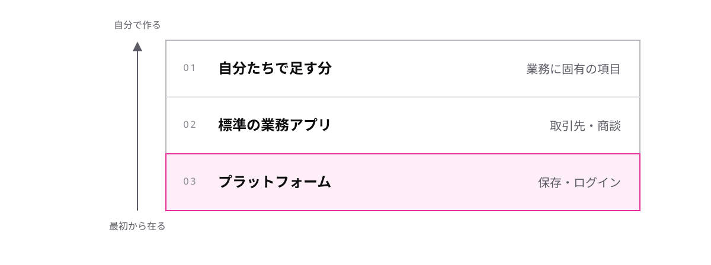

<!-- _class: lead -->

# 0-1-1
# Salesforceは何を提供しているか

Salesforce開発入門 — Module 0 / レッスン0-1

<!-- ノート: 講座の最初のトピックです。ここでつまずくと以降の話が全部ぼやけるので、「Salesforceとは何か」を1文で持って帰ってもらいます。 -->

---

## なぜ必要か

- 「Salesforce の開発」と言われても、何を書くのか像が浮かばない
- 顧客管理の画面のことなのか、開発の道具のことなのか、名前が同じで区別しづらい

<!-- ノート: つかみ。配属前のメンバーが最初に感じる戸惑いをそのまま言葉にする。ここでは答えを言わない。 -->

---

## 結論

**Salesforce は、業務アプリを載せるための土台(プラットフォーム)である**

- **CRM** — 顧客との取引を記録して営業に使う、代表的なアプリ
- **プラットフォーム** — その CRM も載っている、アプリ共通の土台
- 契約すると **組織** という自分たち専用の入れ物が 1 つ渡される

<!-- ノート: 結論を言い切る。世の中で「Salesforce」と呼ばれているものの多くはCRMアプリのほうだが、開発者が相手にするのは土台のほう、と補足する。 -->

---

## 土台の上に載っている

<!-- ノート: 図解。下2層は最初から在るもので、自分たちの仕事はいちばん上だけ。データの保存もログインも画面も土台が持っているので、ゼロから作るWebアプリより書く量が減る、と口頭で添える。 -->

---

## 「組織」という言葉に慣れる

- **組織** = 契約単位で渡される、自分たち専用の Salesforce の入れ物
- データも設定も画面も、すべてどれか 1 つの組織の中にある
- 会社のことではなく、システムの入れ物の名前

<!-- ノート: 用語の注意喚起。日本語の「組織」と紛らわしいので、以後この講座で「組織」と言ったら入れ物のことだと約束する。現場で頻出する語なので早めに慣らす。 -->

---

<!-- _class: summary -->

## まとめ

**Salesforce は、業務アプリを載せるための土台(プラットフォーム)である**

<!-- ノート: 結論の再掲だけ。土台を大勢で分け合っているという話が次につながるが、ここでは口頭でも先出ししない。 -->
