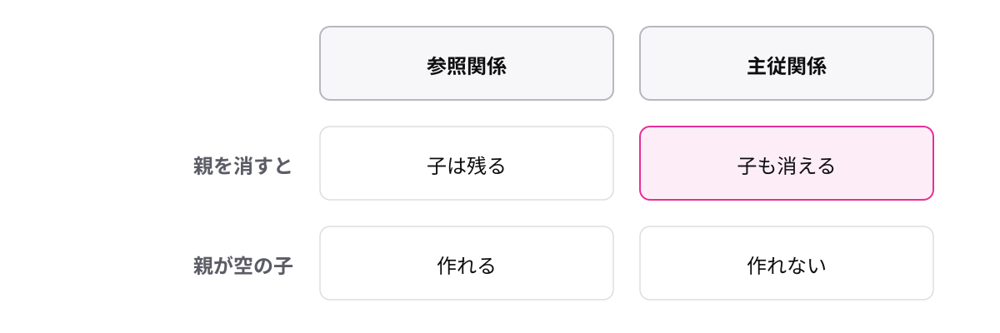

<!-- _class: lead -->

# 1-2-2
# 主従関係で親に従属させる

Salesforce開発入門 — Module 1 / レッスン1-2

<!-- ノート: 参照関係の裏返しです。強い分だけ制約も強い、というトレードオフを持って帰ってもらいます。 -->

---

## なぜ必要か

- 注文明細だけが残っても、何の明細かわからない
- 注文を消したのに明細が残り続けると、集計が合わなくなる

<!-- ノート: つかみ。親無しでは意味をなさないデータがある、という状況を先に見せる。 -->

---

## 結論

**主従関係は子を親に従属させ、親を消すと子も消える**

- **主従関係** — 子が親に属することを前提にしたつながり
- **連鎖削除** — 親を削除すると子も一緒に削除されること

<!-- ノート: 結論を言い切る。子は親無しでは存在できない、という一言で押さえる。 -->

---

## 参照関係との違い

<!-- ノート: 図解。色が付いているのが主従関係だけの挙動。親を消すと子も消える、親が空の子は作れない、の2点を指差す。アクセス権も親に従うことはModule 2で効いてくると口頭で予告する。 -->

---

## 選ぶときの問い

- その子は、親が無くても意味があるか
- **ある** → 参照関係
- **ない** → 主従関係

<!-- ノート: 具体例の枠。判断を1問に畳む。注文と明細は主従、取引先と商談は参照。迷ったら弱いほう(参照)から始めるのが安全だと添える。 -->

---

<!-- _class: summary -->

## まとめ

**主従関係は子を親に従属させ、親を消すと子も消える**

<!-- ノート: 結論の再掲だけ。強くつないだからこそできることがある、と引いて締める。 -->
