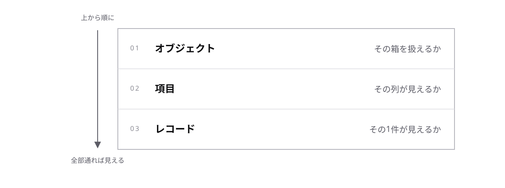

# レッスン2-1 誰が何を見られるか

## このレッスンの目標

- [ ] 「見えない」の原因を、3 つの層に切り分けられる
- [ ] プロファイルと権限セットを使い分けられる
- [ ] Apex がどの権限で動くかを API バージョンから判断できる

## 2-1-1 アクセス権の 3 つの層

> **アクセス権は、オブジェクト・項目・レコードの 3 つの層が重なって決まる**



「このユーザだけ商談が見えない」という問い合わせは、配属直後にいちばん多く頼まれる調査です。設定画面は多いので、場所を暗記する前に切り分けの軸を持ちます。

- **オブジェクトレベルセキュリティ** — その種類の箱を扱えるか
- **項目レベルセキュリティ** — その列が見えるか
- **レコードレベルセキュリティ** — その 1 件が見えるか

症状から層を引けます。

| 症状 | 疑う層 |
| --- | --- |
| メニューに商談が無い | オブジェクト |
| 一覧は出るが金額欄が無い | 項目 |
| 自分の商談しか出ない | レコード |

3 つは AND で効きます。オブジェクトが閉じていれば、項目もレコードも関係なく見えません。広げるときは、上の層から順に確かめてください。レコードの共有だけ広げても、オブジェクトが閉じていれば何も変わりません。

## 2-1-2 プロファイルと権限セット

> **プロファイルで土台を配り、権限セットで個別に足す**

上の 2 層(オブジェクト・項目)を設定する場所です。

- **ユーザ** — ログインする 1 人
- **プロファイル** — ユーザにちょうど 1 つ割り当てる、権限の土台
- **権限セット** — 上乗せで何枚でも足せる権限のかたまり

「営業の田中さんにだけ、原価の項目を見せたい」と頼まれたとき、営業プロファイルを直すと営業全員に見えてしまいます。プロファイルは 1 人 1 つ、権限セットは何枚でも、という数の違いが使い分けの根拠になります。

| 相手 | 与えるもの |
| --- | --- |
| 営業全員 | 営業プロファイル |
| 田中さんだけ | 原価参照の権限セット |

権限セットでできるのは **足すこと** だけです。「この人だけ見えなくする」は作れません。見せたくないなら、土台のほうを狭くして必要な人に足す、という向きで設計します。

## 2-1-3 組織の共有設定

> **組織の共有設定が、レコードを所有者以外に見せるかどうかの既定値を決める**

3 層目です。プロファイルも権限セットも同じなのに見える件数が違う、という状況はここで起きます。

- **所有者** — そのレコードを持っているユーザ
- **組織の共有設定** — オブジェクトごとに決める、所有者以外への既定の公開範囲

所有者を持つオブジェクトでは、既定値を「非公開」にすると所有者のものだけが見えます。
既定値はオブジェクトごとに選ぶもので、「非公開」はその選択肢の 1 つです。
なお 1-2-2 の主従関係の子レコードは**所有者を持たず**、親のアクセス権に従うので、
この設定の対象になりません(共有設定の一覧にも出てきません)。

| 既定値 | 所有者以外は |
| --- | --- |
| 非公開 | 見えない |
| 参照のみ | 見えるが編集できない |
| 参照・更新可能 | 編集もできる |

既定より広く見せたいときは **共有ルール**(条件を決めて公開範囲を広げる仕組み)を足します。共有ルールで狭めることはできません。見せたくないレコードがあるなら、既定値のほうを狭くします。

2-1-2 と同じ形です。この基盤は一貫して「狭い既定 + 追加で広げる」で設計されています。

## 2-1-4 Apex とアクセス権

> **いまの Apex は、既定で実行ユーザの権限に従って動く**

画面では他人の商談が見えないのに自作の一覧には全件出てしまう、あるいは逆に動いていたコードが権限エラーで止まる。どちらも、Apex がどの権限で動いているかを取り違えたときに起きます。

- **ユーザモード** — オブジェクト・項目・レコードの 3 つとも確認して動くこと
- **システムモード** — 権限を確認せずに動くこと

2-1-1 で見た 3 つの層は、画面だけの話ではありません。**API バージョン 67.0 以降の Apex は、データベース操作が既定でユーザモード**で動きます。宣言を書かなくても、実行ユーザのオブジェクト権限・項目レベルセキュリティ・レコードの共有がすべて効きます。

```apex
public with sharing class OrderService {
  // 検索も更新も、実行ユーザに許された範囲だけ
}
```

**with sharing** はレコードの共有に従うことを明示する宣言です。67.0 以降は書かなくてもこの動きですが、意図を残すために書きます。読む人が「わざとそうしている」と分かるからです。逆に、意図して権限を越える必要があるときは `without sharing` を書き、なぜ越えるのかをコメントに残します。

ここが近年変わった点で、**古い解説記事とは食い違います**。案件のコードを読むときは、まず API バージョンを確かめてください。

| | API バージョン 66.0 以前 | 67.0 以降 |
| --- | --- | --- |
| 既定の動き | システムモード | ユーザモード |
| 宣言の無い Apex | 共有を無視 | 共有に従う |

**トリガは例外**で、どの API バージョンでも常にシステムモードで動きます(4-2-1 で扱います)。トリガから呼び出す先の Apex は、その Apex 自身のバージョンと宣言に従います。

## もっと知りたい人へ

- [Salesforce ヘルプ](https://help.salesforce.com/) — 共有ルール・ロール階層・手動共有の違い
- [Salesforce 開発者向けドキュメント](https://developer.salesforce.com/docs) — データベース操作のアクセスモード(`USER_MODE` / `SYSTEM_MODE`)と、`with sharing` / `without sharing` / `inherited sharing` の使い分け

---

演習は [practice.md](practice.md) にあります。
