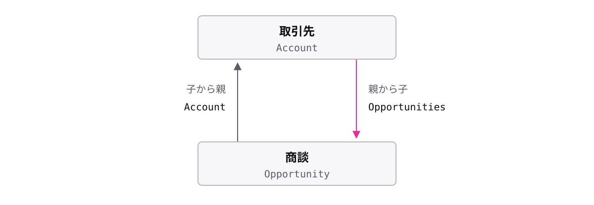

# レッスン3-1 レコードを取り出す

## このレッスンの目標

- [ ] SOQL の基本形を書き、SQL との違いを説明できる
- [ ] WHERE で必要なレコードだけに絞り込める
- [ ] 親子をまたぐ取得を、向きに応じた書き方で書ける

## 3-1-1 SOQL の基本形

> **SOQL は 1 つのオブジェクトから、欲しい項目を名指しして取り出す**

**SOQL** は Salesforce のレコードを取り出すための問い合わせ言語です。名前は Salesforce Object Query Language。表ではなくオブジェクトを相手にする、という一点が名前に出ています。取り出す内容を書いた 1 つの問い合わせを **クエリ** と呼びます。

```apex
SELECT Name, Phone FROM Account
```

`FROM` に書くのはオブジェクトの API 参照名、`SELECT` には欲しい項目を並べます。ここまでは SQL と同じ形です。

違いもあります。

| | SQL | SOQL |
| --- | --- | --- |
| 全列を取る | `SELECT *` | 書けない |
| 相手 | 表 | オブジェクト |

`*` が無いのは、取得量に上限がある基盤だからです。必要な項目だけを運ぶ設計になっています。

## 3-1-2 WHERE で絞り込む

> **WHERE を付けると、条件に合うレコードだけに絞り込める**

取引先が数万件ある組織で全件を取り出すと、処理が止まります。0-1-2 のガバナ制限が、具体的な形で効いてくる最初の場面です。

```apex
SELECT Name FROM Account WHERE Industry = 'Manufacturing'
```

**WHERE** は `FROM` の後ろに置き、残すレコードの基準を **条件** として書きます。文字列はシングルクォートで囲みます(ダブルクォートは使えません)。条件は `AND` / `OR` でつなげます。

書き忘れの怖さは、すぐには現れないところにあります。

| クエリ | 起きること |
| --- | --- |
| `SELECT Name FROM Account` | 全件を取ろうとして上限に当たる |
| `... WHERE Industry = '...'` | 必要な行だけ返る |

開発用の組織はデータが少ないので、WHERE を忘れても動いてしまいます。件数が増えて初めて壊れる、というのがこの事故の厄介なところです。

## 3-1-3 子から親をたどる

> **子から親の項目へは、リレーション項目の名前にドットをつないでたどる**

商談の一覧に取引先の名前も出したい、というときに SQL のつもりで JOIN を書こうとすると、書く場所がありません。SOQL に JOIN 句はなく、代わりに **ドット表記** でリレーションをたどります。

```apex
SELECT Name, Account.Name FROM Opportunity
```

`Account` は商談が持つ、取引先へのリレーション項目です。その先の `Name` をドットでたどっています。つながり方はデータモデルが知っているので、結合条件を毎回書く必要がありません。

たどるときに使う名前を **リレーション名** と呼びます。カスタムのリレーションは、項目そのものと名前が違うので注意が必要です。

| 種類 | 項目名 | たどるときの名前 |
| --- | --- | --- |
| 標準 | `AccountId` | `Account` |
| カスタム | `Store__c` | `Store__r` |

項目そのものを指すときは `__c`、親をたどるときは `__r` です。

## 3-1-4 親から子を取り出す

> **親から子は、SELECT の中にサブクエリを書いてまとめて取り出す**



取引先の一覧を出しながら、それぞれの商談も並べたい。取引先を取ってから 1 件ずつ商談を問い合わせると、問い合わせ回数が件数分になります。

```apex
SELECT Name, (SELECT Name, Amount FROM Opportunities)
FROM Account
```

`SELECT` の中に丸かっこで入れ子にしたクエリが **サブクエリ** です。1 回のクエリで、親と子をまとめて取れます。問い合わせ回数が件数に比例しない、という点がこの書き方の値打ちです。

丸かっこの中の `Opportunities` は複数形になっています。これは **子リレーション名** で、親の項目名ではありません。向きによって使う名前が変わります。

| 向き | 書く名前 | 例 |
| --- | --- | --- |
| 子 → 親 | リレーション名 | `Account` |
| 親 → 子 | 子リレーション名 | `Opportunities` |

子リレーション名はカスタムだと末尾が `__r` になります。実際の名前は、設定画面のリレーション定義で確認できます。

## もっと知りたい人へ

- [Salesforce 開発者向けドキュメント](https://developer.salesforce.com/docs) — SOQL・SOSL リファレンス(使える演算子・関数の一覧)
- [Salesforce ヘルプ](https://help.salesforce.com/) — 開発者コンソールのクエリエディタの使い方

---

演習は [practice.md](practice.md) にあります。
