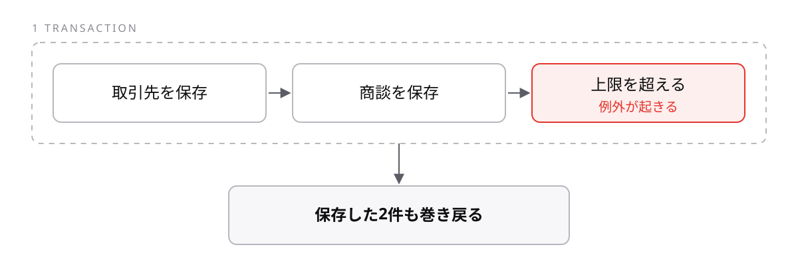

<!-- _class: lead -->

# 4-2-4
# 制限を超えたときに起きること

Salesforce開発入門 — Module 4 / レッスン4-2

<!-- ノート: Module 4の最後です。制限を超えたときの挙動を知っておくと、障害の一次切り分けができるようになります。 -->

---

## なぜ必要か

- 取り込みが失敗したと言われたが、一部だけ入っているのか全部戻ったのかわからない
- 復旧の手順が、そこで変わってしまう

<!-- ノート: つかみ。障害対応でまず確認したい点。仕組みを知っていれば調べる前に見当がつく。 -->

---

## 結論

**ガバナ制限を超えると例外が起き、そのトランザクションは丸ごと巻き戻る**

- **例外** — 処理を続けられないときに投げられる異常の知らせ
- **ロールバック** — その処理でのデータの変更を、すべて無かったことにすること

<!-- ノート: 結論を言い切る。中途半端な状態が残らないのは救いでもある。ただし「一部だけ入る」ことを期待した設計はできない。 -->

---

## 握りつぶせない

```apex
try {
  // ここで SOQL の回数が上限を超えると
} catch (Exception e) {
  // ここには入ってこない
}
```

- ガバナ制限の例外は、`try` で受け止められない

<!-- ノート: 最小のコード。普通の例外と違い、制限超過は捕まえられない。回避策を書く場所は無く、書き方を直すしかない、と言い切る。 -->

---

## 途中まで成功していても戻る



<!-- ノート: 図解。破線の中が1トランザクション。3件目で落ちると、成功していた2件も消える。だから「一部だけ入る」ことを期待した設計はできない。逃げ道は例外を捕まえることでも上限交渉でもなく、ループの外に出す書き方だけ、と締める。 -->

---

<!-- _class: summary -->

## まとめ

**ガバナ制限を超えると例外が起き、そのトランザクションは丸ごと巻き戻る**

<!-- ノート: 結論の再掲だけ。書いたコードが本当に束で動くのか、どう確かめるのかという問いを残して締める。 -->
