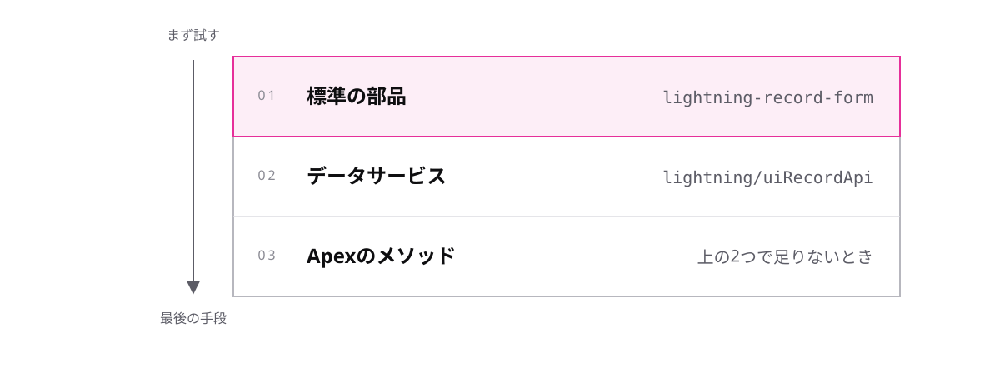

<!-- _class: lead -->

# 6-1-3
# LWCは3つのファイル

Salesforce開発入門 — Module 6 / レッスン6-1

<!-- ノート: 講座の最後のトピックです。実装までは踏み込まず、案件で見かけたときに読める地図だけを渡します。 -->

---

## なぜ必要か

- 標準の部品では足りない画面を頼まれる
- 案件のリポジトリを開くと、見慣れないフォルダが並んでいる

<!-- ノート: つかみ。配属直後にコードを読む場面。構造を知っていれば、どこから読めばよいかわかる。 -->

---

## 結論

**LWC は HTML・JavaScript・設定ファイルの 3 つで 1 つの部品になる**

- **LWC** — Lightning Web コンポーネント。自作の画面部品を作る仕組み
- 3 つのファイルは同じ名前のフォルダにまとめて置く

<!-- ノート: 結論を言い切る。Web標準に近い書き方なので、JavaScriptの知識がそのまま効く。この講座では実装まではやらない。 -->

---

## フォルダの中身

| ファイル | 役割 |
| --- | --- |
| `orderList.html` | 見た目 |
| `orderList.js` | ふるまい |
| `orderList.js-meta.xml` | どこに置ける部品かの設定 |

- 3 つ目が無いと、設定画面の部品一覧に出てこない

<!-- ノート: 具体例。meta.xmlの存在を知らないと「作ったのに置けない」で詰まる。ここだけは覚えて帰ってもらう。 -->

---

## データはどこから取るか

<!-- ノート: 図解。0-1-3の「標準が先」がここでも同じ形で効く。レコードの表示・編集は上2つでほとんど賄えて、アクセス権もキャッシュも基盤が見てくれる。Apexは最後の手段で、選んだときはModule 4の作法がそのまま要る、と締める。 -->

---

<!-- _class: summary -->

## まとめ

**LWC は HTML・JavaScript・設定ファイルの 3 つで 1 つの部品になる**

<!-- ノート: 結論の再掲だけ。講座全体の締めとして、設定が先・一括処理・テストの3つを持ち帰ってもらう。 -->
