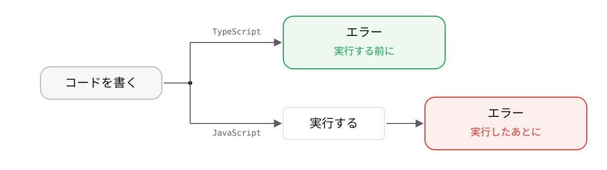

<!-- _class: lead -->

# 0-1-2
# TypeScriptは間違いを実行前に見つける

TypeScript入門研修 — Module 0 / レッスン0-1

<!-- ノート: 前のトピックで「気づくのが遅い」という問題を見ました。この研修で学ぶ道具は、そこにまっすぐ効きます。 -->

---

## なぜ必要か

- 前のトピックの`"300" + 50`は、動かすまで誰も気づけなかった
- 書いている最中に教えてくれる相手がいれば、その場で直せる

<!-- ノート: つかみ。人間のレビューを待つのではなく、機械に見張らせるという発想。前のトピックの具体例をそのまま引き継ぐと理解が速い。 -->

---

## 結論

**TypeScriptは、型を書くことで間違いを実行前に見つける**

- 型 = その値が「どんな種類か」を表す情報
- コンパイラー = 型を見て、おかしな箇所を指摘してくれるプログラム

<!-- ノート: 結論を先に言い切る。型とコンパイラーという2つの言葉をここで定義する。TypeScriptはJavaScriptに型を書けるようにした言語であり、別物ではないことも添える。 -->

---

## 最小のコード

```ts
const price: number = "300";
// エラー: Type 'string' is not assignable to type 'number'.
```

- `: number` が「これは数値です」という宣言
- 文字列を入れようとした時点で、**実行前に**エラーになる

<!-- ノート: 0-1-1と同じ題材を型付きで書き直す。コロンの右が型、という書き方の細かい話はModule 1で扱うので、ここでは「宣言しておくと守ってくれる」という体験だけ持ち帰ってもらう。 -->

---

## いつ間違いに気づく?



<!-- ノート: 左が実行してから気づく世界、右が実行前に気づく世界。TypeScriptは右側に立つための道具。エラーという言葉は「間違いの指摘」であって、怖いものではないと添える。 -->

---

<!-- _class: summary -->

## まとめ

**TypeScriptは、型を書くことで間違いを実行前に見つける**

<!-- ノート: 結論の再掲だけ。ただしブラウザやサーバーが理解できるのはJavaScriptだけ。ではTypeScriptはどうやって動くのか、という問いを残して締める。 -->
