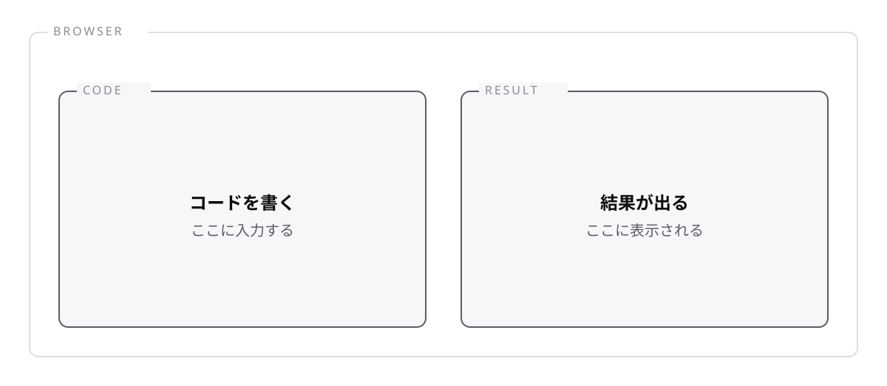

<!-- _class: lead -->

# 0-2-1
# Playgroundで書き始める

TypeScript入門研修 — Module 0 / レッスン0-2

<!-- ノート: レッスン0-2では、実際にコードを書く場所を用意します。この研修はModule 8まで、ここだけで完結します。 -->

---

## なぜ必要か

- 環境構築でつまずいて、学習が始まる前に止まってしまうことがある
- 「まず動かす」までの時間は、短いほどよい

<!-- ノート: つかみ。未経験者の脱落理由の上位が環境構築。だから本研修では後回しにする、という設計の意図を先に伝えておくと安心してもらえる。 -->

---

## 結論

**Playgroundを開けば、インストールなしでTypeScriptを書いて動かせる**

- ブラウザ上で動く公式の実行環境
- <https://www.typescriptlang.org/ja/play>

<!-- ノート: 結論を先に言い切る。URLを実際に開いて見せる。ブックマークしておくよう案内する。自分のPCへの環境構築はModule 9で扱うので、それまでは不要だと明言する。 -->

---

## 画面は2つに分かれている

<!-- ノート: 図で画面を案内する。右の「.JS」タブは、0-1-3で学んだ「変換されて動く」を目で確かめられる場所。型注釈が消えていることを実際に見せると理解が定着する。 -->

---

## 書いたコードはURLで共有できる

- コードを書くとURLが自動で変わる
- そのURLを送れば、相手も同じコードを開ける

<!-- ノート: 対比枠。演習で詰まったときに講師へ共有する手段として使う、と実用面を案内する。ファイルの受け渡しが不要なのがPlaygroundの強み。 -->

---

<!-- _class: summary -->

## まとめ

**Playgroundを開けば、インストールなしでTypeScriptを書いて動かせる**

<!-- ノート: 結論の再掲だけ。書く場所ができたので、次は結果を確認する方法に進むと予告して締める。 -->
