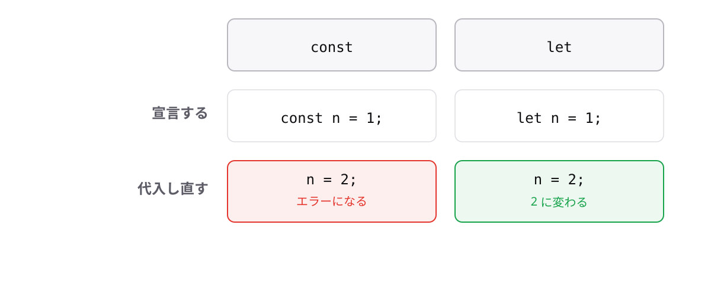

<!-- _class: lead -->

# 1-1-2
# constとletの違い

TypeScript入門研修 — Module 1 / レッスン1-1

<!-- ノート: 前のトピックでは変数が「値に名前を付ける仕組み」だと確認しました。ここでは名前の付け方が2種類あることを学びます。 -->

---

## なぜ必要か

- 変数には「変わっていく値」と「変わってほしくない値」がある
- 実務あるある: 税率をうっかり上書きして、金額が全部ずれる

<!-- ノート: つかみ。税率や単価のような「変わってほしくない値」が途中で書き換わる事故は現場で本当に起きる。宣言キーワードを選ぶだけでこれを防げる、という期待を持たせる。 -->

---

## 結論

**constは再代入できない、letはできる**

- 再代入 = すでにある変数に、別の値を入れ直すこと

<!-- ノート: 結論を先に言い切る。再代入という用語をここで定義する。宣言と代入が同時に起きる1回目ではなく、2回目以降の代入が「再代入」だと区別する。 -->

---

## 最小のコード

```ts
let stockCount = 10;
stockCount = 8; // 再代入OK
console.log(stockCount); // => 8

const taxRate = 0.1;
taxRate = 0.08;
// エラー: Cannot assign to 'taxRate' because it is a constant.
```

<!-- ノート: 在庫数のように変わっていく値がletの出番。2行目の頭にletがない点を強調する。constのほうはPlaygroundで実際に赤線が出るところを見せる。エラーは「taxRateは定数なので代入できません」という意味だと読み下す。 -->

---

## あとから代入し直せる?



<!-- ノート: letは新しい値を受け入れ、constは弾く。この1枚で対比を焼き付ける。下の帯の「まずはconst」は次のトピックの結論なので、ここでは読み上げるだけにとどめる。 -->

---

<!-- _class: summary -->

## まとめ

**constは再代入できない、letはできる**

<!-- ノート: 結論の再掲だけ。では実際どちらを使えばいいのか、という問いを残して次につなぐ。 -->
