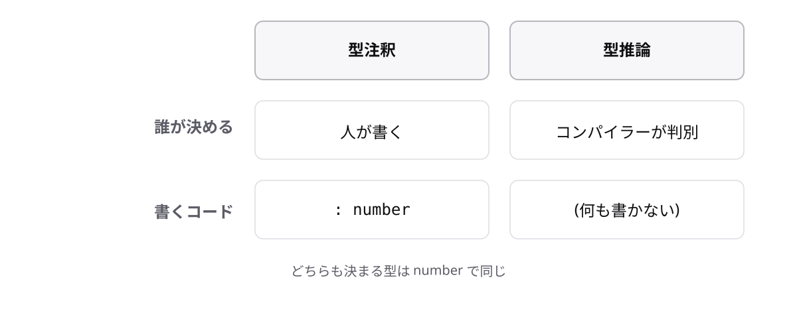

# レッスン1-2 型注釈と型推論

## このレッスンの目標

- [ ] 型が「値の種類」であることを説明できる
- [ ] 型注釈`変数名: 型`で変数を宣言できる
- [ ] 型推論の仕組みを理解し、型注釈を書くべき場面を判断できる

## 1-2-1 型とは何か

> **型とは、その変数に入れてよい値の種類のこと**

金額を入れるつもりの変数に、文字列が入ってしまうことがあります。フォームの入力値は文字列で届くため、「数値のつもりが文字列だった」という事故は現場で本当に起きます。これを防ぐ仕組みが型です。

型は全部で7種類ありますが、まずは次の3つの名前だけ覚えれば十分です。

- `number` — 数値
- `string` — 文字列
- `boolean` — 真偽値(はい / いいえ)

```ts
const price = 300; // 数値 → number型
const productName = "コーヒー"; // 文字列 → string型
const isOnSale = true; // 真偽値 → boolean型
```

型名はすべて小文字で書きます。大文字始まりの`Number`や`String`は別物なので使いません(エディターの補完で誤って選びやすいので注意)。

それぞれの型の詳しい性質はレッスン1-3と1-4で扱います。

## 1-2-2 型注釈の書き方

> **型注釈は、変数名のうしろにコロンと型名を書く**

型を頭の中で意識するだけでは、コンパイラーは助けてくれません。コードに書いて初めて機械がチェックできるようになります。その書き方が**型注釈**です。

```
const 変数名: 型 = 値;
```

```ts
const price: number = 300;
const productName: string = "コーヒー";
```

コロンの右が型、イコールの右が値です。変数名が先で型が後という語順に注意してください(JavaやC言語とは逆です)。

左右を逆にすると、型名が値として扱われてしまいます。

```ts
const price: 300 = number;
// エラー: Cannot find name 'number'.
```

## 1-2-3 型注釈が防いでくれるもの

> **型注釈があると、違う種類の値を入れた瞬間に実行前のエラーで気づける**

JavaScriptでは、間違った値を入れても実行するまで気づけません。気づくのは、たいてい本番でおかしな数字を見たときです。TypeScriptは、このタイミングを「書いている最中」に前倒しします。

```ts
let price: number = 300;
price = "無料";
// エラー: Type 'string' is not assignable to type 'number'.
```

`assignable`は「代入できる」という意味です。このメッセージには型名が2つ登場します。

```
Type 'string' is not assignable to type 'number'.
     ^^^^^^                          ^^^^^^
     入れようとした型                 受け入れ側の型
```

この形のメッセージは今後いちばん多く出会います。エラーは怖くありません。読めば原因が書いてあります。

## 1-2-4 型推論

> **型注釈を書かなくても、初期値から型は自動で決まる**

実際のコードを見ると、型注釈が書かれていない変数のほうが多くあります。これは書き忘れではありません。

**初期値**(宣言と同時に入れる最初の値)があれば、コンパイラーが型を自動で判別してくれます。これを**型推論**と呼びます。

```ts
let price = 300; // 型注釈なし → number型と推論される
price = "無料";
// エラー: Type 'string' is not assignable to type 'number'.
```

型注釈を書いた場合とまったく同じエラーが出ます。チェックの厳しさは変わりません。Playgroundでは変数にマウスカーソルを乗せると、推論された型を確認できます。



## 1-2-5 注釈と推論、どちらを書くか

> **初期値がある変数は推論に任せる。書くのは推論できないときだけ**

同じ結果になるなら、毎回どちらにするか迷ってしまいます。本研修では次の方針で統一します。

書かないのは手抜きではなく、正しいスタイルです。`300`と書いてあるのに`number`とも書くのは同じ情報の重複であり、値を変えたときに書き換え漏れが起きます。

```ts
const orderCount = 3; // 推論: number ← これでよい
const memberName = "佐藤"; // 推論: string ← これでよい

let deliveryDate: string; // 初期値がない → 推論できないので書く
```

ただし、配属先に「常に型注釈を書く」規約があれば、そちらが最優先です。

## もっと知りたい人へ

- [変数宣言の型注釈](https://typescriptbook.jp/reference/values-types-variables/type-annotation) — 型注釈の構文の詳しい説明
- [変数宣言の型推論](https://typescriptbook.jp/reference/values-types-variables/type-inference) — 型推論の仕組みの詳しい説明

---

演習は [practice.md](practice.md) にあります。
