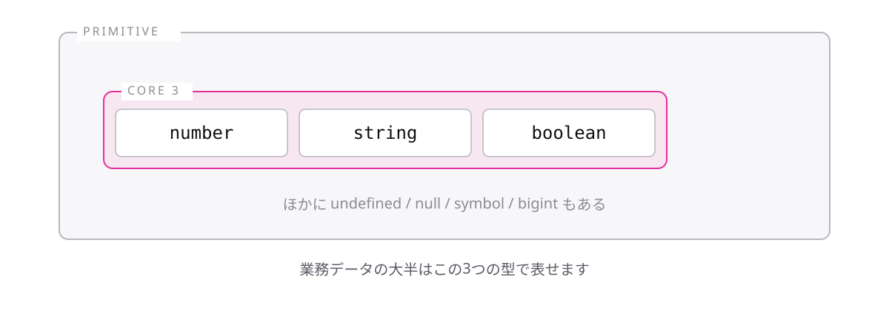

<!-- _class: lead -->

# 1-3-1
# プリミティブ型は7種類

TypeScript入門研修 — Module 1 / レッスン1-3

<!-- ノート: レッスン1-2で型の書き方を学びました。ここからは型そのものを1つずつ見ていきます。まず全体地図を頭に入れます。 -->

---

## なぜ必要か

- 検索すると`symbol`や`bigint`といった知らない型名が出てくる
- 全体像がないと、覚える量が無限にあるように見えてしまう

<!-- ノート: つかみ。学習の最初に「どこまで覚えれば足りるか」の線を引いてあげることが、脱落を防ぐいちばんの近道。 -->

---

## 結論

**プリミティブ型は7種類あるが、研修で使うのはnumber・string・booleanの3つ**

- プリミティブ型 = それ以上分解できない、基本の値の種類
- 残りの4つは`null`・`undefined`・`symbol`・`bigint`

<!-- ノート: 結論を先に言い切る。primitiveは「原始的な・基本の」という意味。nullとundefinedはレッスン1-6で扱う。symbolとbigintは実務で書く機会がほとんどないので、名前だけ知っていれば十分と整理する。 -->

---

## プリミティブ型は7種類、まず3つ

<!-- ノート: 7種類の全体像を1枚で見せる。上の3つが主役、下の4つは灰色=今は覚えなくてよい、と視覚的に優先順位を付ける。この地図に戻ってこられるようにしておく。 -->

---

<!-- _class: summary -->

## まとめ

**プリミティブ型は7種類あるが、研修で使うのはnumber・string・booleanの3つ**

<!-- ノート: 結論の再掲だけ。ここから3つを1つずつ掘り下げていくと予告して締める。 -->
