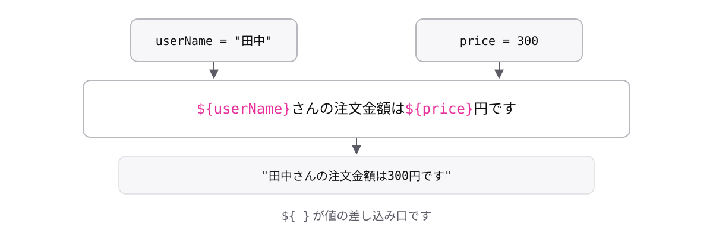

# レッスン1-4 文字列

## このレッスンの目標

- [ ] 3種類のクォートの違いを説明できる
- [ ] テンプレートリテラルで文字列に変数を埋め込める
- [ ] `+`が型によって意味を変えることを理解している

## 1-4-1 string型とクォート

> **文字列はクォートで囲む。研修ではダブルクォートを基本にする**

記事によって`"`だったり`'`だったり`` ` ``だったりします。違いがわからないと、コピーしたコードを直せません。ここで一度で片付けます。

- `"` ダブルクォート — 本研修の基本
- `'` シングルクォート — 意味は同じ
- `` ` `` バッククォート — 特別な機能つき(1-4-2で扱います)

```ts
const userName = "田中"; // string
const message = 'こんにちは'; // これもstring
console.log(userName); // => "田中"
```

どれで囲んでも型は同じ`string`です。本研修でダブルクォートを基本にするのは、後のモジュールで学ぶPrettier(自動整形ツール)の慣習に合わせるためです。

クォートを付け忘れると、値ではなく変数名として扱われます。

```ts
const userName: string = 田中;
// エラー: Cannot find name '田中'.
```

「型が違う」ではなく「名前が見つからない」というエラーになる点に注目してください。

## 1-4-2 テンプレートリテラル

> **バッククォートで囲むと、文字列の中に変数を埋め込める**

「田中さんの注文金額は300円です」のような文を組み立てたい場面は、通知メッセージ・ログ・画面表示と、実務で毎日発生します。

バッククォートで囲んだ文字列の中では、`${変数名}`と書くと値がはめ込まれます。この書き方を**テンプレートリテラル**と呼びます。

```ts
const userName = "田中";
const price = 300;
const message = `${userName}さんの注文金額は${price}円です`;
console.log(message);
// => "田中さんの注文金額は300円です"
```

バッククォートは、日本語キーボードでは`Shift`+`@`で入力できます。



`${ }`が働くのはバッククォートのときだけです。ダブルクォートの中ではただの文字として扱われ、エラーも出ません。

```ts
const userName = "田中";
console.log("${userName}さん、こんにちは");
// => "${userName}さん、こんにちは"
```

画面に`${...}`がそのまま出てしまう失敗は定番です。見つけたらクォートの種類を疑ってください。

## 1-4-3 「+」の2つの顔

> **「+」は相手が文字列なら連結、数値なら足し算になる**

合計金額が`1001`ではなく`"1001"`になっていた、という事故があります。エラーが出ないので、画面を見るまで気づけません。

**連結**とは、2つの文字列をつなげて1つにすることです。同じ`+`という記号が、相手の型によって足し算にも連結にもなります。

```ts
console.log(100 + 1); // => 101   (数値 + 数値 → 足し算)
console.log("100" + 1); // => "1001" (文字列 + 数値 → 連結)
console.log("注文" + "確定"); // => "注文確定"
```

2行目がすべての事故の正体です。`"100"`はクォートで囲まれているので`string`型、だから`+`は連結として働きます。


記号ではなく型を見る癖をつけてください。フォームの入力値は文字列で届くため、集計処理でこの事故が起きます。型注釈を書いておけば、コンパイラーが混在に気づけるチャンスが増えます。

## もっと知りたい人へ

- [string型](https://typescriptbook.jp/reference/values-types-variables/string) — 文字列とクォートの詳しい説明
- [型強制](https://typescriptbook.jp/reference/values-types-variables/type-coercion) — 型が自動で変換される仕組み

---

演習は [practice.md](practice.md) にあります。
