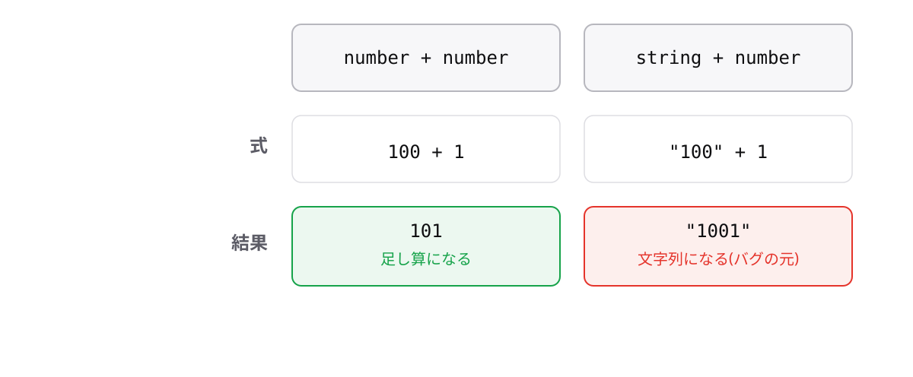

<!-- _class: lead -->

# 1-4-3
# 「+」の2つの顔

TypeScript入門研修 — Module 1 / レッスン1-4

<!-- ノート: レッスン1-4の最後は、Module 1でいちばん重要な落とし穴です。ここを知っているかどうかで、デバッグにかかる時間が変わります。 -->

---

## なぜ必要か

- 実務あるある: 合計金額が`1001`ではなく`"1001"`になっていた
- エラーが出ないので、画面を見るまで気づけない

<!-- ノート: つかみ。フォームの入力値は文字列で届くため、この事故は集計処理で本当に起きる。エラーにならない=静かなバグである点が怖さの本体。 -->

---

## 結論

**「+」は相手が文字列なら連結、数値なら足し算になる**

- 連結 = 2つの文字列をつなげて1つにすること

<!-- ノート: 結論を先に言い切る。同じ記号が2つの意味を持つ、というのがすべての原因。「+の意味は相手の型で決まる」と覚えてもらう。 -->

---

## 最小のコード

```ts
console.log(100 + 1); // => 101   (数値 + 数値 → 足し算)
console.log("100" + 1); // => "1001" (文字列 + 数値 → 連結)
console.log("注文" + "確定"); // => "注文確定"
```

<!-- ノート: 3行を上から順に読み比べる。2行目がすべての事故の正体。"100"はクォートで囲まれているのでstring型、だから+は連結として働く。 -->

---

## 「+」は相手の型で意味が変わる



<!-- ノート: 左が足し算、右が連結。型バッジ(number / string)に注目させ、記号ではなく型を見る癖をつけてもらう。右の結果"1001"がバグの正体。型注釈を書いておけば、この混在にコンパイラーが気づけると1-2につなげる。 -->

---

<!-- _class: summary -->

## まとめ

**「+」は相手が文字列なら連結、数値なら足し算になる**

<!-- ノート: 結論の再掲だけ。レッスン1-4はここまで。演習ではテンプレートリテラルで業務メッセージを組み立てる問題を用意していると誘導して締める。 -->
