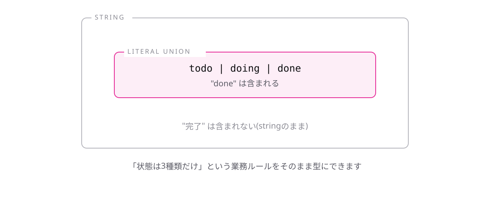

<!-- _class: lead -->

# 1-5-3
# リテラル型とユニオン型を組み合わせる

TypeScript入門研修 — Module 1 / レッスン1-5

<!-- ノート: リテラル型とユニオン型、それぞれ単体では地味でした。組み合わせた瞬間に、実務で最も使う型の書き方になります。 -->

---

## なぜ必要か

- タスクの状態、注文の状態、会員ランク…選択肢が決まった項目は無数にある
- タイポひとつで、動くけれど誤判定するコードができてしまう

<!-- ノート: つかみ。"done"と書くべきところを"Done"と書いた場合、string型なら通ってしまい、条件分岐が静かに外れる。この事故を型で潰せるのがここの価値。 -->

---

## 結論

**リテラル型を「|」でつなぐと、決まった値だけを許す型になる**

- 業務ルールをそのまま型として書ける

<!-- ノート: 結論を先に言い切る。「型で仕様を表現する」という、TypeScriptの一番おいしい使い方の入口。ここが腹落ちすると以降のモジュールが楽になる。 -->

---

## 最小のコード

```ts
let taskStatus: "todo" | "doing" | "done" = "todo";
taskStatus = "done"; // OK
taskStatus = "完了";
// エラー: Type '"完了"' is not assignable to
// type '"todo" | "doing" | "done"'.
```

<!-- ノート: 3つの選択肢のどれかしか入らない。エラーメッセージに許される値が全部並ぶので、何を書けばよいかがメッセージ自体からわかる点も実務価値として伝える。 -->

---

## リテラルユニオン ― 決まった値だけを通す



<!-- ノート: 決まった値だけを通す門番として図解する。"done"は通過して代入でき、"完了"は門前でコンパイルエラーとして弾かれる。実行前に弾ける点が実務価値。 -->

---

<!-- _class: summary -->

## まとめ

**リテラル型を「|」でつなぐと、決まった値だけを許す型になる**

<!-- ノート: 結論の再掲だけ。実はこのリテラル型、自分で書かなくても勝手に現れることがある、と引きを作って次につなぐ。 -->
