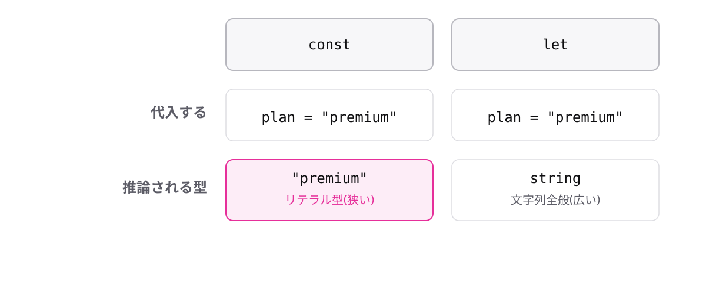

<!-- _class: lead -->

# 1-5-4
# constは狭く、letは広く推論される

TypeScript入門 — Module 1 / レッスン1-5

<!-- ノート: レッスン1-5の最後です。リテラル型は自分で書かなくても現れます。その仕組みを知っておくと、型の表示を見て混乱しなくなります。 -->

---

## なぜ必要か

- Playgroundで型を確認すると、`string`ではなく`"premium"`と表示されることがある
- 仕組みを知らないと、バグかと思って手が止まる

<!-- ノート: つかみ。実際に受講者から必ず出る質問。先回りして答えておくと、以降の自習がスムーズになる。 -->

---

## 結論

**constはリテラル型に、letは広い型に推論される**

- `const`は再代入されないと確定している → 値そのものが型でよい
- `let`は再代入されうる → 同じ種類の値なら受け入れる型になる

<!-- ノート: 結論を先に言い切る。理由が大事。再代入できるかどうかで、コンパイラーが決める型の広さが変わる。1-1-2のconstとletの違いが、ここで型の話につながる。 -->

---

## 最小のコード

```ts
const plan = "premium";
// planの型は "premium" (リテラル型)

let currentPlan = "premium";
// currentPlanの型は string
```

<!-- ノート: Playgroundで両方にマウスカーソルを乗せて型の違いを実演すると、一発で伝わる。同じ値を代入しているのに型が違う、というのが驚きポイント。 -->

---

## constは「最も狭い型」に推論される



<!-- ノート: 同じ"premium"の代入でも、constなら値そのものの狭い型、letなら文字列全般の広い型になる。バッジの横幅の違いが型の広さを表している。 -->

---

<!-- _class: summary -->

## まとめ

**constはリテラル型に、letは広い型に推論される**

<!-- ノート: 結論の再掲だけ。レッスン1-5はここまで。演習に進んでから、Module 1最後のレッスンへと誘導して締める。 -->
