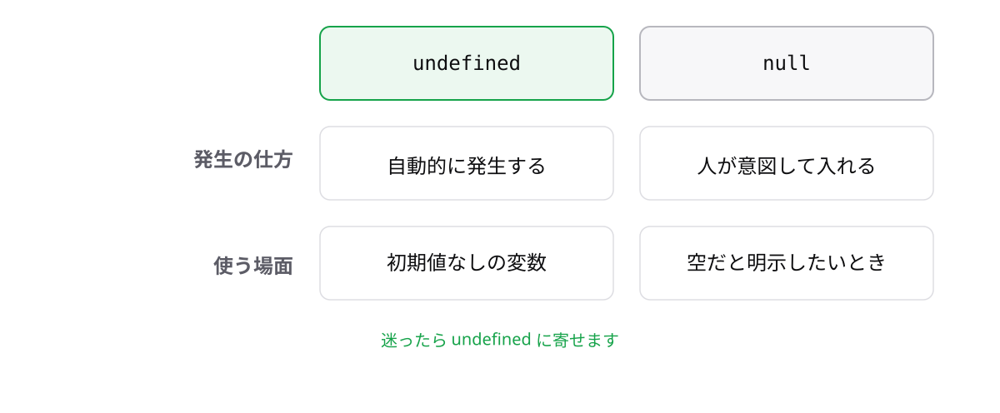

<!-- _class: lead -->

# 1-6-4
# 迷ったらundefinedに寄せる

TypeScript入門 — Module 1 / レッスン1-6

<!-- ノート: nullとundefinedの意味の違いはわかりました。ただ実際に書くとき、その違いで毎回悩むのは非効率です。方針を1つ決めます。 -->

---

## なぜ必要か

- 意味の違いは微妙で、チームで基準を揃えるのが難しい
- 2種類あると、チェックも2種類書くことになる

<!-- ノート: つかみ。「nullでもundefinedでもない」ことを毎回2回確認するのは、コードも思考も増える。統一すると単純に楽になる。 -->

---

## 結論

**「値がない」はundefinedに統一する。nullは受け取るときだけ使う**

- 自分が書く側では`undefined`だけを使う
- 外部のライブラリーが`null`を返す場合は、受け取って扱う

<!-- ノート: 結論を先に言い切る。TypeScriptの開発チーム自身もnullを避ける方針を取っている、という後ろ盾も添える。ただし配属先の規約が最優先であることは必ず言う。 -->

---

## 2つの「値がない」

<!-- ノート: 左の点線の箱が「まだ何も入れていない」undefined、右の箱が「空だと書いてある」null。自然発生するかどうかが最大の違い。下の帯が今回の結論。 -->

---

<!-- _class: summary -->

## まとめ

**「値がない」はundefinedに統一する。nullは受け取るときだけ使う**

<!-- ノート: 結論の再掲だけ。では「空になりうる」ことを型でどう書くのか、を最後に見ると予告して締める。 -->
