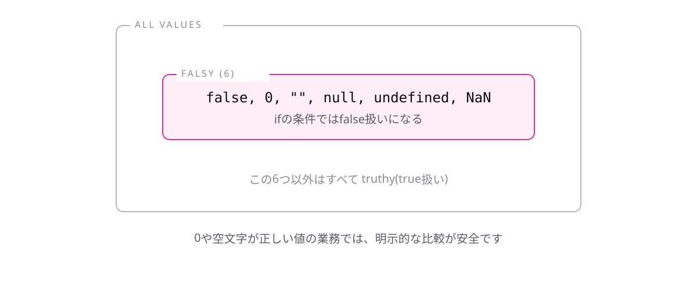

<!-- _class: lead -->

# 2-3-1
# truthyな値とfalsyな値

TypeScript入門研修 — Module 2 / レッスン2-3

<!-- ノート: レッスン2-3では、条件分岐と型を組み合わせます。まずは、他人のコードを読むときに必ずぶつかる書き方から。 -->

---

## なぜ必要か

- 実務のコードには `if (userName) { ... }` のような書き方が頻出する
- 比較演算子がないのに、なぜ条件になるのかがわからないと読めない

<!-- ノート: つかみ。2-2-1では条件はbooleanを作るものだと学んだ。それと矛盾して見える書き方を、ここで説明する。 -->

---

## 結論

**条件には`boolean`以外も書ける。`0`と空文字は`false`扱いになる**

- falsyな値(false扱い): `false` `0` `""` `undefined` `null` `NaN`
- truthyな値(true扱い): **それ以外すべて**

<!-- ノート: 結論を先に言い切る。falsyは6つだけなので、こちらを覚えて「残りは全部truthy」と整理する。空文字は引用符2つだけの文字列のこと。NaNは計算に失敗した数値で、詳細は不要。 -->

---

## 最小のコード

```ts
const userName = "";

if (userName) {
  console.log("ようこそ");
} else {
  console.log("名前が未入力です");
}
// => "名前が未入力です"
```

<!-- ノート: 空文字はfalsyなのでelse側に入る。userNameに"田中"を入れると出力が変わることを実演する。「値が入っているか」をひとことで確かめられるのが、この書き方が好まれる理由。 -->

---

## falsyは6つだけ、残りは全部truthy



<!-- ノート: falsyの6つを図で確認する。落とし穴は0。在庫が0件のときや金額が0円のときも「値がない」と判定されてしまう。数値を判定するときはfalsy頼みにせず、明示的に比較すべきだと必ず添える。 -->

---

<!-- _class: summary -->

## まとめ

**条件には`boolean`以外も書ける。`0`と空文字は`false`扱いになる**

<!-- ノート: 結論の再掲だけ。次は、この条件分岐が型そのものを動かすという話に進むと予告して締める。 -->
