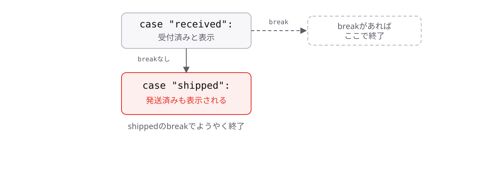

<!-- _class: lead -->

# 2-4-2
# breakの書き忘れ

TypeScript入門研修 — Module 2 / レッスン2-4

<!-- ノート: switchの書き方はわかりました。ここでは、switchでいちばん有名な落とし穴を1つだけ押さえます。 -->

---

## なぜ必要か

- `break`を1つ忘れるだけで、意図しない処理まで走る
- エラーにならないので、動かしてみるまで気づけない

<!-- ノート: つかみ。0-1-1で見た「気づくのが遅いバグ」の典型例がこれ。しかも見た目は正しく見えるので、レビューでも見落とされやすい。 -->

---

## 結論

**`break`を書き忘れると、次の`case`の中身まで続けて実行される**

- この現象をフォールスルー(落ちていく)と呼ぶ

<!-- ノート: 結論を先に言い切る。フォールスルーという言葉を定義する。caseは「入り口」を決めるだけで、出口を決めるのはbreak。この理解があると忘れにくい。 -->

---

## 最小のコード

```ts
const status = "received";

switch (status) {
  case "received":
    console.log("受付済み");
  // ← breakがない
  case "shipped":
    console.log("発送済み");
    break;
}
// => "受付済み"
// => "発送済み"  ← 意図していない
```

<!-- ノート: 1つ目に当たったあと、breakがないので2つ目の中身まで実行されてしまう。Playgroundで実際に2行出るところを見せると強く印象に残る。 -->

---

## breakがないと次のcaseへ落ちる



<!-- ノート: caseは入り口、breakは出口。出口がないと下へ落ちていく様子を図で確認する。防ぎ方は単純で、caseを書いたら必ずbreakをセットで書くこと。ESLintで自動検出もできる(Module 9で扱う)。 -->

---

<!-- _class: summary -->

## まとめ

**`break`を書き忘れると、次の`case`の中身まで続けて実行される**

<!-- ノート: 結論の再掲だけ。次はswitchが本当に強くなる組み合わせを見ると予告して締める。 -->
