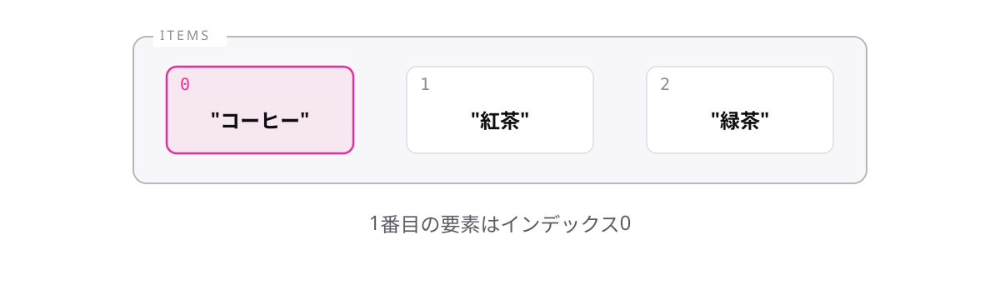

# レッスン3-1 配列の基本

## このレッスンの目標

- [ ] 配列を作り、型注釈を書ける
- [ ] インデックスで要素を取り出せる
- [ ] `length`で要素数を数え、範囲外アクセスの危険を説明できる

## 3-1-1 配列とは

> **配列は、同じ種類の値を順番に並べて1つにまとめたもの**

商品が3つあるだけで変数を3つ作ることになり、10個、100個になったら手に負えません。そもそも個数が事前にわからない場合は変数を用意しようがありません。

- **要素** — 配列に入っている1つ1つの値
- **配列リテラル** — 角かっこ`[ ]`で値を並べる書き方

```ts
const items: string[] = ["コーヒー", "紅茶", "緑茶"];
console.log(items); // => ["コーヒー", "紅茶", "緑茶"]

const prices = [480, 500, 450]; // 推論: number[]
```

型注釈は**要素の型のうしろに`[]`**を付けます。`string[]`は「文字列の配列」と読みます。レッスン1-2の方針どおり、初期値があれば推論に任せて構いません。

`Array<number>`という書き方もありますが、本研修は`number[]`で統一します。

配列は「同じ種類の値」を並べるものなので、違う型が混ざるとエラーになります。

```ts
const prices: number[] = [480, "500", 450];
// エラー: Type 'string' is not assignable to type 'number'.
```

## 3-1-2 インデックス

> **要素は角かっこと番号で取り出す。番号は0から始まる**

**インデックス**とは、要素の位置を表す番号です。**1番目の要素はインデックス`0`**になります。

```ts
const items = ["コーヒー", "紅茶", "緑茶"];

console.log(items[0]); // => "コーヒー"
console.log(items[1]); // => "紅茶"
console.log(items[2]); // => "緑茶"
```

0から始まる理由は歴史的なものなので、深追いは不要です。「1番目は0番」と口に出して覚えてください。



## 3-1-3 lengthで要素数を数える

> **配列の要素数は`length`でわかる。最後のインデックスは`length - 1`**

検索結果やAPIの応答は件数が事前にわからないため、数える手段が必要です。

```ts
const items = ["コーヒー", "紅茶", "緑茶"];

console.log(items.length); // => 3
console.log(items[items.length - 1]); // => "緑茶"
```

個数は`3`、最後のインデックスは`2`です。`length`は個数なので1から数え、インデックスは0から数えます。**この1つのズレがバグの温床**なので、対応関係を固めておいてください。

ドットに続けて`length`と書きます。かっこは付けません。

条件分岐と組み合わせるのが実務での定番です。

```ts
const results: string[] = [];

if (results.length === 0) {
  console.log("該当する商品はありません");
}
// => "該当する商品はありません"
```

空の配列は角かっこだけで書けます。件数の判定は、レッスン2-3のfalsy頼みにせず`length`を明示的に比較したほうが意図が伝わります。

## 3-1-4 存在しない要素はundefined

> **範囲外のインデックスは`undefined`になるが、型は教えてくれない**

TypeScriptが守ってくれない、数少ない場面の1つです。

```ts
const items = ["コーヒー", "紅茶"];

console.log(items[5]); // => undefined
const name: string = items[5]; // エラーにならない
```

実際の値は`undefined`なのに、型の上では`string`のままです。Playgroundで`items[5]`にカーソルを乗せると`string`と表示されます。レッスン1-6で学んだ`strictNullChecks`も、配列の範囲までは面倒を見てくれません。

型が守ってくれない以上、自分で確かめます。

```ts
const items = ["コーヒー", "紅茶"];
const index = 5;

if (index < items.length) {
  console.log(items[index]);
} else {
  console.log("その商品はありません");
}
// => "その商品はありません"
```

`tsconfig`の`noUncheckedIndexedAccess`という設定で型を厳しくすることもできます。Module 9で触れます。

## もっと知りたい人へ

- [配列](https://typescriptbook.jp/reference/values-types-variables/array) — 配列の詳しい説明
- [配列の型注釈](https://typescriptbook.jp/reference/values-types-variables/array/type-annotation-of-array) — `number[]`と`Array<number>`の比較

---

演習は [practice.md](practice.md) にあります。
