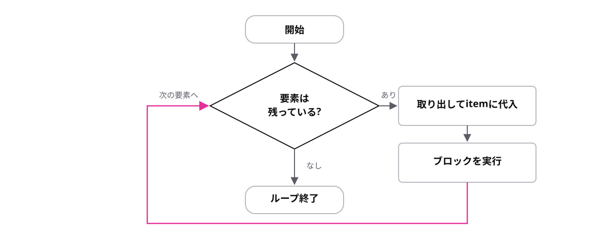

<!-- _class: lead -->

# 3-2-3
# for-ofで1つずつ取り出す

TypeScript入門研修 — Module 3 / レッスン3-2

<!-- ノート: ここが Module 3 の山場です。配列と繰り返しが合流して、はじめて「まとめて処理する」ができるようになります。 -->

---

## なぜ必要か

- `items[0]`、`items[1]`…と書いていては、要素が増えたら書き足すことになる
- そもそも件数が分からない配列には手が出ない

<!-- ノート: つかみ。3-1-2で1つずつ取り出す方法は学んだが、それを人が手で並べるのは限界がある。件数に関係なく同じコードで処理したい、という要求。 -->

---

## 結論

**`for-of`は、配列の要素を先頭から1つずつ取り出して繰り返す**

```
for (const 変数 of 配列) {
  1要素ごとに実行される
}
```

<!-- ノート: 結論を先に言い切る。繰り返しという言葉を定義する。ofの左が「取り出した1つを入れる変数」、右が「取り出す元の配列」。この変数は毎回新しく作られるのでconstでよい。 -->

---

## 最小のコード

```ts
const items = ["コーヒー", "紅茶", "緑茶"];

for (const item of items) {
  console.log(item);
}
// => "コーヒー"
// => "紅茶"
// => "緑茶"
```

- 要素が10個でも100個でも、コードは同じ

<!-- ノート: 変数名は単数形(item)、配列名は複数形(items)にすると読みやすい、という命名の慣習も添える。中かっこは2-1-1で学んだブロックなので、itemのスコープはこの中だけ。 -->

---

## 先頭から1つずつ取り出して繰り返す



<!-- ノート: 配列から1つ取り出してブロックを実行し、また次を取り出す、という流れを図でなぞる。要素がなくなったらループを抜ける。インデックスを自分で管理しなくてよいのがfor-ofの利点。 -->

---

<!-- _class: summary -->

## まとめ

**`for-of`は、配列の要素を先頭から1つずつ取り出して繰り返す**

<!-- ノート: 結論の再掲だけ。1つずつ表示できたので、次は数え上げや集計に使うと予告して締める。 -->
