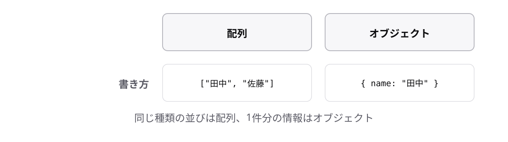

<!-- _class: lead -->

# 3-3-1
# オブジェクトとは

TypeScript入門研修 — Module 3 / レッスン3-3

<!-- ノート: 配列は「同じ種類の値の並び」でした。ここでは、種類の違う値をまとめる道具に入ります。実務でいちばん出会うデータの形です。 -->

---

## なぜ必要か

- 1人のユーザーは「名前・年齢・メール」がセットで意味を持つ
- 配列だと`user[0]`が名前、`user[1]`が年齢…と覚えなければならない

<!-- ノート: つかみ。番号で覚えるのは人間に向いていない。しかも順番を入れ替えたら全部壊れる。名前で取り出したい、という要求が自然に出てくる。 -->

---

## 結論

**オブジェクトは、種類の違う値に名前を付けて1つにまとめたもの**

- プロパティ = 「名前と値」の組
- オブジェクトリテラル = 中かっこ`{ }`でプロパティを並べる書き方

<!-- ノート: 結論を先に言い切る。プロパティとオブジェクトリテラルを定義する。中かっこは2-1-1のブロックと見た目が同じだが別物。値を作る側の中かっこだと区別する。 -->

---

## 最小のコード

```ts
const user = {
  name: "田中",
  age: 28,
};

console.log(user); // => { name: "田中", age: 28 }
```

- `名前: 値` をカンマで区切って並べる

<!-- ノート: コロンの左がプロパティ名、右が値。型注釈のコロンと形が似ているが、こちらは値を書く場所。最後の要素の後ろにもカンマを付けてよい(付けておくと行を足しやすい)。 -->

---

## 配列は番号で並ぶ、オブジェクトは名前で持つ



<!-- ノート: 左の配列は番号で並び、右のオブジェクトは名前で並ぶ。同じ種類の値を並べるなら配列、違う種類をひとまとまりにするならオブジェクト、という使い分けを図で固める。 -->

---

<!-- _class: summary -->

## まとめ

**オブジェクトは、種類の違う値に名前を付けて1つにまとめたもの**

<!-- ノート: 結論の再掲だけ。まとめたので、次は中の値を取り出す方法に進むと予告して締める。 -->
