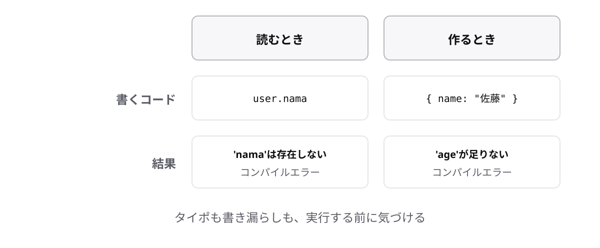

<!-- _class: lead -->

# 3-3-4
# 型が守ってくれる2つのこと

TypeScript入門研修 — Module 3 / レッスン3-3

<!-- ノート: レッスン3-3の最後です。オブジェクトに型を書くと何が起きるのかを、具体的に2つだけ確認します。 -->

---

## なぜ必要か

- 型を書く手間に見合う見返りがあるのかを、はっきりさせておきたい
- オブジェクトは項目が多いぶん、事故も起きやすい

<!-- ノート: つかみ。プロパティが10個もあれば、1つ書き忘れることは普通に起きる。人の注意力に頼らない仕組みがここにある。 -->

---

## 結論

**オブジェクトの型は、プロパティ名のタイポと、書き漏らしの両方を止める**

<!-- ノート: 結論を先に言い切る。読むときのタイポと、作るときの漏れ。オブジェクトで起きる事故のほとんどはこの2つに収まる。 -->

---

## 最小のコード

```ts
const user: { name: string; age: number } = { name: "田中", age: 28 };

// (1) 読むときのタイポ
console.log(user.nama);
// エラー: Property 'nama' does not exist on type ...

// (2) 作るときの書き漏らし
const member: { name: string; age: number } = { name: "佐藤" };
// エラー: Property 'age' is missing in type '{ name: string; }'
```

<!-- ノート: (1)は3-3-2で見たもの。JavaScriptならundefinedが返るだけで気づけない。(2)のmissingは「不足している」という意味で、何が足りないかが名指しで書いてあるので、メッセージどおりに足せば直る。 -->

---

## 型が守ってくれる2つのこと



<!-- ノート: 読む側と作る側、両方の入り口で型が見張っている。この2つが効くだけで、オブジェクトまわりのバグは大きく減る。実務で型を書く価値がいちばん実感しやすい場面。 -->

---

<!-- _class: summary -->

## まとめ

**オブジェクトの型は、プロパティ名のタイポと、書き漏らしの両方を止める**

<!-- ノート: 結論の再掲だけ。レッスン3-3はここまで。ただし型を毎回書くのは長い、という不満を残して次につなぐ。 -->
